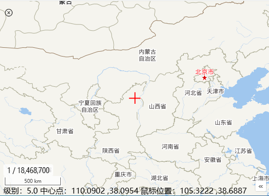

# xgis-ol开发说明文档

​	xgis-ol 0.4.x版本以后版本是基于openlayer 10.2.x + ol-ext +quasar +vue开发的进行封装的二维GIS开发库，下面为主要组件和核心类的使用说明。

## 1、开始安装使用

1. 安装xgis-ol库

   ```
    pnpm add  xgis-ol 
    pnpm add ol
   ```

2. 引入类库和样式    

   ```ts
   import {XMap } from 'xgis-ol';
   import 'xgis-ol/dist/index.css'
   ```

3. 绑定初始化地图（最简单的）

   ```vue
   <template>
       <div id="map"></div>
   </template>
   
   <script setup lang="ts">
   import { onMounted } from 'vue';
   import { XMap } from 'xgis-ol';
   import 'xgis-ol/dist/index.css';
   import {Tile} from 'ol/layer';
   import {OSM} from 'ol/source';
   onMounted(() => {
       const xmap = new XMap('map', 'mapGroupName');
       xmap.initMapView({
           zoom: 5,
           center: [116.46229441189399, 40.24876149],
           minZoom: 1,
           maxZoom: 22,
           projection: "EPSG:4326",
       });
       xmap.map.addLayer(new Tile({source:new OSM()}))
   });
   </script>
   <style scoped>
   #map {
       width: 100%;
       height: 100vh;
   }
   </style>
   ```

   - new XMap 构建XMap对象

   - 调用initMapView初始化地图视图VIEW

   - xmap.map.addLayer加载地图图层

​         应用效果：


##  2、正常地图构建方法

### 2.1、 加载外部地图配置构建

地图配置**IMapConfig**定义：

```ts
/**
 * 地图初始化配置文档
 */
export interface IMapConfig
{
    id:string,//地图绑定id
    group?:string,//所属组
    hasLayerManager?:boolean,//是否需要图层管理对象
    isInternet?:boolean,//是否是内网环境
    tdtXYZLocalURL?:string,//天地图内网发布地址 模版地址，例如http://192.168.1.122:9000/DataServer?T={layerName}&x={x}&y={y}&l={z}
    projInfo?:IProjInfo,
    viewOptions:ViewOptions,
    layers?:Array<string>,//默认加载的图层（底图）
    controls?:Array<IControlOption>,//地图组件
    interactions?:Array<IControlOption>,//交互式组件
}
```

public文件夹下的地图配置文档：**DefaultMapConfig.json**

```json
{
    "id":"map",
    "group":"map",
    "hasLayerManager":false,
    "isInternet":true,
     "viewOptions":{
        "zoom":5,
        "center":[116.46229441189399, 40.24876149],
        "minZoom":1,
        "maxZoom":22,
        "projection":"EPSG:4326",
        "multiWorld":true
     },
     "layers":["vec_c","cva_c"],
     "controls":[
      {
        "key":"target",
        "options":{
          "visible":true,
          "composit":"default"
        }
      },
      {
        "key":"overview",
        "options":{
          "align":"right",
          "layers":[0,1]
        }
      },
      {
        "key":"scale"
      },
      {
        "key":"scaleline"
      }
     ],
     "interactions":[
      {
        "key":"FishEyeClip",
        "options":{
          "active":false,
          "radius":10,
          "layers":[0,1]
        }
      }
     ]
  }
```

**补充说明：**

1. viewOptions对应ol/view里的ViewOptions定义；
2. layers 只支持天地图相关图层、OSM；
3. 配置controls和interactions里的key名字是固定的；
4. overview缩略图的options.layers可选，支持配置number为图层索引、string为图层ID，默认空时，加载OSM图层；
5. FishEyeClip鱼眼组件的options.layers支持透视图层，配置number为图层索引、string为图层ID，不能空；


使用地图配置构建地图示例**XMapWidget.vue**

路径：<u>src/widgets/olwidgets/map/XMapWidget.vue</u>

```vue
<template>
    <div class="MainMapWidget">
        <div id="map" class="mapstyle">
        <ZoomFullBar :xmap="mapRef" :hasLayerTree="hasLayerTree" class="q-gutter-y-xs  xmap-zoombar" />
        </div>
    </div>
</template>

<script setup lang="ts">
import { onMounted, ref } from 'vue';
import { Global, requestGet } from 'xframelib';
import { PrjGridTool, XMap, ZoomFullBar } from 'xgis-ol';
import 'xgis-ol/dist/index.css';

const mapRef=ref<XMap>();
const hasLayerTree=ref(false);
onMounted(async () => {
    const configResult = await requestGet('', 'DefaultMapConfig.json').catch(ex => {
        Global.Message.warn('加载地图初始化配置DefaultMapConfig.json失败！' + ex.Message);
    })
    //地图-初始化参数
    const mapConfig = configResult.data;
    if (mapConfig.projInfo) {
        mapConfig.viewOptions.Projection = PrjGridTool.getProjection(mapConfig.projInfo);
    }
    //地图初始化
    const xmap = XMap.initByMapConfig(mapConfig);
    mapRef.value=xmap;
    hasLayerTree.value=!!xmap.LayerManager;
    //全局绑定地图
    Global.XMap = xmap;
});
</script>
<style lang="scss" scoped>
.MainMapWidget {
    position: absolute;
    left: 0px;
    top: 0px;
    bottom: 0px;
    right: 0px;
}
#map {
    position: relative;
    width: 100%;
    height: 100%;
.xmap-zoombar
 {
    position: absolute;
    left:10px;
    bottom:80px;
 }
}
:deep(.ol-scale-line)
{
    bottom:18px;
}
:deep(.ol-mouse-position) {
    position: absolute;
    top: unset;
    left: 8px;
    bottom: -2px;
    z-index: 10;
}
</style>
```

使用效果：



### 2.2、 使用OLXMap组件构建

OLXMap是对XMap的封装，自带左右两个主面板插槽，具有较大的扩展自由度。默认自带ZoomFullBar组件和ContextMenu组件。

插槽点：

**#mapLeftPanel** 地图左侧浮动面板，默认为空

**#mapRightPanel** 地图右侧浮动面板，默认为地图扩展菜单，包括已加载ZoomFullBar组件和进一步扩展工具栏插槽#mapRightExtend。

**#mapRightExtend**  右侧面板里的插槽，进一步扩展工具栏菜单

使用示例：OLXMapWidget.vue

路径:<u>**src/widgets/olwidgets/map/OLXMapWidget.vue**</u>

通过**hasContextMenu**来控制**右键菜单**是否加载显示，默认是加载显示的。

```vue
<template>
    <div :style="mainContainStyle">
        <OLXMap mapid="map" :hasLayerManager="false" :defaultCenter="[108.95, 34.5]" :initTDTLayers="['vec_c', 'cva_c']"
            viewProjection='EPSG:4326' @mapInited="mapInitedHandler" v-if="showMap">
            <template #mapLeftPanel>
                <!-- 扩展弹框 -->
                <div class="leftPanel">
                    这是左侧扩展面板
                </div>
            </template>
        </OLXMap>
    </div>
</template>

<script lang="ts" setup>
import { onMounted, ref } from 'vue';
import { H5Tool } from 'xframelib';
import {OLXMap,XMap} from 'xgis-ol';
import 'xgis-ol/dist/index.css';
const showMap = ref(false);
const mainContainStyle = ref('');
function resizeMap() {
    const result = `position:relative;width:100%;height:100vh`;
    mainContainStyle.value = result;
};
//获取地图元数据加载地图
let xMap: XMap;
function mapInitedHandler(res) {
    xMap = res.xmap;
}
onMounted(() => {
    showMap.value = true;
    resizeMap();
    H5Tool.windowResizeHandler(() => {
        resizeMap();
    })
});
</script>
<style lang="scss" scoped>
.leftPanel {
    background-color: #eee;
    width: 200px;
    height: 200px;
}
</style>
```

使用效果：


### 2.3、 使用XMapView组件构建

XMapView组件是在OLXMap基础上进一步封装，默认包括放大缩小MenuToolBar、绘制工具DrawToolBar和量算工具MeasureToolBar。

具有插槽点：

-  #mapLeftPanelGroup左侧面板

-  #extendMenuGroup 右侧扩展菜单部分

  

使用示例：XMapViewWidget.vue,进一步扩展加载了SwipeToolBar、OtherTool,增加了经纬度、墨卡托投影切换功能。

路径：src/widgets/olwidgets/map/XMapViewWidget.vue

```vue
<template>
    <XMapView
      :hasLayerTree="true"
      :viewHeight="layoutContentHeight"
      :viewProjection="viewProjectionRef"
      :viewWidth="layoutContentWidth"
      :initTDTLayers="['vec_c','cva_c']"
      @mapInited="mapInitedHandler"
      v-if="enableXMap"
    >
      <template #mapLeftPanelGroup>
        <div class="datapanel" v-show="dataPanelVisible">
          <slot name="dataPanel"></slot>
        </div>
      </template>
      <template #extendMenuGroup>
        <div style="position: relative">
          <SwipeToolBar :xmap="mapRef" />
        </div>
        <div style="position: relative; margin-top: 10px">
          <OtherTool
            :xmap="mapRef"
            @drag-box-feature="dragSearchHandler"
          ></OtherTool>
        </div>
      </template>
    </XMapView>
    <div class="prjSelectBar q-gutter-sm">
      <q-radio v-model="PrjValue" val="C" label="经纬度" @update:model-value="prjChageHandler"     />
      <q-radio v-model="PrjValue" val="W" label="墨卡托" @update:model-value="prjChageHandler"      />
    </div>
  </template>
```

**使用效果：**


## 3、主要业务组件

### 3.1、 ZoomFullBar组件

ZoomFullBar组件默认提供了 **放大、缩小、图层管理、全屏、默认视图、在线定位**功能。

- hasLayerTree:控制是否启用“图层管理”按钮，默认为false;
- isInternet:控制是否显示在线定位，默认为true;（受XMap的isInternet影响）
- hasFullScreen：控制是否显示“全屏”按钮，默认为true;

使用参考：ZoomFullControlWidget.vue

**作为独立widget使用时，hasFullScreen需设置为false 。**

```vue
<template>
    <div>
        <ZoomFullBar :xmap="mapRef" :hasLayerTree="hasLayerTree" :hasFullScreen="false" class="q-gutter-y-sm" />
    </div>
</template>

<script setup lang="ts">
import { ZoomFullBar,XMap } from 'xgis-ol';
import { onMounted,ref } from 'vue';
import { Global } from 'xframelib';
const mapRef=ref<XMap>();
const hasLayerTree=ref(false);
onMounted(()=>{
  if(Global.XMap)
  {
    mapRef.value=Global.XMap as XMap;
    hasLayerTree.value=!!mapRef.value.LayerManager;
  }
})
</script>
```


### 3.2、MenuToolBar组件


### 3.3、DrawToolBar组件


### 3.4、MeasureToolBar组件


### 3.5、SwipeToolBar组件


### 3.6、ContextMenu组件

ContextMenu右键菜单，自己初始化XMap的需要单独添加ContextMenu进行挂接。

默认使用**OLXMap**和**XMapView**构建地图的，**自带默认的右键菜单**。


默认 右键菜单：


