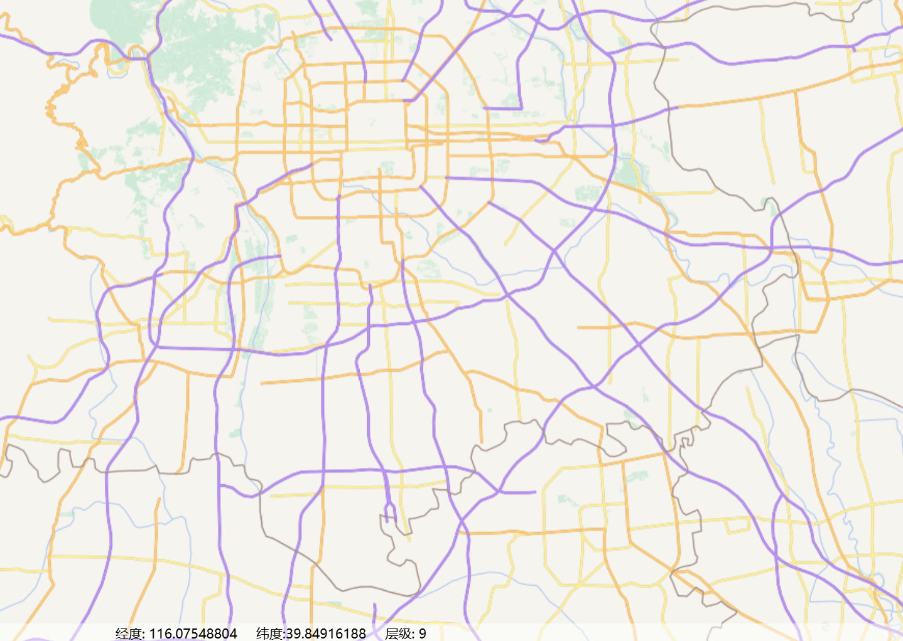
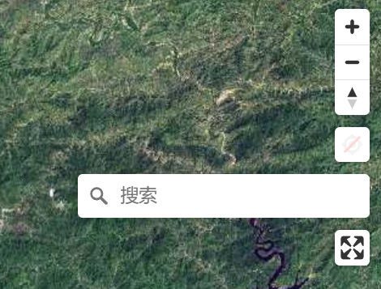
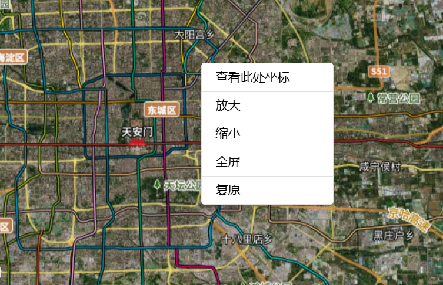
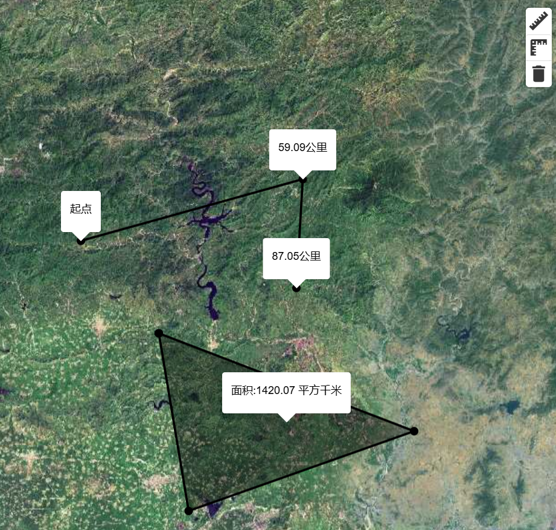
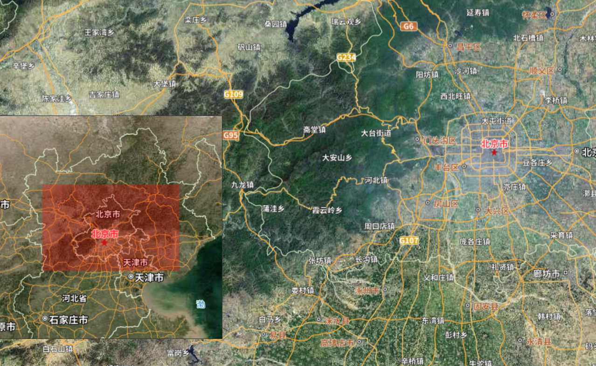

# mapbox-gl开发说明文档

## 1、开始安装使用

1. 安装mapbox库

   ```
    pnpm install mapbox-gl 
   ```
   
2. 引入类库和样式    

   ```ts
   import { Map, StyleSpecification } from 'mapbox-gl';
   import 'mapbox-gl/dist/mapbox-gl.css';
   ```

3. 绑定初始化地图（最简单的使用天地图底图）

   ```vue
   <template>
       <div id="mapcontent" style="width: 100vw; height: 100vh">
       </div>
   </template>
   <script setup lang="ts">
   import { Map, StyleSpecification } from 'mapbox-gl';
   import { EmitMsg } from 'src/events';
   import MapEvent from 'src/events/modules/MapEvent';
   import { onMounted, onUnmounted } from 'vue';
   import { Global } from 'xframelib';
   import MapTool, { TDTBaceMapType } from "./MapTool";
   
   import "mapbox-gl/dist/mapbox-gl.css";
   
   const mapid = 'mapcontent';
   
   function initMap(mapstyle: StyleSpecification) {
       if (!Global.map) {
           const map = new Map({
               container: mapid,
               style: mapstyle, // stylesheet location
               center: mapstyle.center!, // starting position [lng, lat]
               zoom: mapstyle.zoom, // starting zoommapstyle.zoom
               attributionControl: false,
               accessToken: 'pk.eyJ1IjoiY2hyaXNuaW5nIiwiYSI6ImNrZzk3dmNveTA2cGUycXAyNXJ3bWNsOHMifQ._4oFj3iqj5yWWvbuONDYnw'
           });
           Global.map = map;
           Global.MapStyle = mapstyle;
           //地图已经初始化构建了
           EmitMsg(MapEvent.MainMapWidgetLoaded, map);
           map._locale['ScaleControl.Meters'] = '米';
           map._locale['ScaleControl.Kilometers'] = '千米';
   
       } else {
           EmitMsg(MapEvent.MainMapWidgetLoaded, Global.map);
       }
   }
   
   //初始化加载地球
   onMounted(async () => {
       const mapstyle =MapTool.GetTDTBaseStyle([116.383125473,39.9114357],TDTBaceMapType.TDT_Img);
       initMap(mapstyle);
   });
   
   onUnmounted(() => {
   });
   </script>
   <style lang="scss" scoped>
   </style>
   
   <style>
   .mapboxgl-ctrl-bottom-left .mapboxgl-ctrl .mapboxgl-ctrl-logo{
       display:none !important;
   }
   </style>
   
   ```
   
   - new Map 构建Map对象
   
   - 调用MapTool.GetTDTBaseStyle初始化地图视图Style
   

​         应用效果：



## 2、主要业务组件

### 2.1、 Mapbox基础组件

Mapbox默认提供了 **放大、缩小、全屏**功能。



- NavigationControl:导航组件

- ScaleControl:比例尺组件

- FullscreenControl：全屏组件

- MapboxGeocoder: 地名搜索组件

  ​	搜索组件需要添加类库 和引用

  ```ts
  //安装库
  pnpm install @mapbox/mapbox-gl-geocoder
  
  //引用库
  import MapboxGeocoder from '@mapbox/mapbox-gl-geocoder';
  import '@mapbox/mapbox-gl-geocoder/dist/mapbox-gl-geocoder.css';
  ```

  

使用参考：MapControlWidget.vue

```vue
function InitControl(){
	//导航组件
    const navigation =new NavigationControl();
    map.addControl(navigation,'top-right')

    //比例尺组件
    scaleControl = new ScaleControl({
        unit:'metric'
    });
    map.addControl(scaleControl, 'bottom-left');

    //地名搜索组件
    geocoder = new MapboxGeocoder({
        accessToken: MapTool.accessToken
    });
    map.addControl(geocoder,'top-left');

    // 全屏组件
    fullscreen = new FullscreenControl();
    map.addControl(fullscreen, 'top-right');
}
```


### 2.2、ContextMenu组件

基础右键菜单组件包含图层放大、缩小、全屏、复原(方位角和俯仰角)选项



使用参考：MapDefaultMenuWidget.vue

```vue
<template>
    <q-popup-proxy :model-value="visible" target="#clickMenuPopup" transition-show="flip-up" transition-hide="flip-down"
        @hide="visible = false">
        <div style="width: 150px">
            <q-list bordered separator dense>
                <q-item class="items-center" clickable v-ripple v-for="(item,index) in menuList" :key="index" @click="OperationAction(item.value)">
                    {{item.label}}
                </q-item>
            </q-list>
        </div>
    </q-popup-proxy>
</template>

<script lang="ts" setup>
import { ref, onMounted, onUnmounted } from 'vue';
import { Global } from 'xframelib';
import { Map } from "mapbox-gl";

const menuList=ref([
    {
        label:'放大',
        value:0
    },
    {
        label:'缩小',
        value:1
    },{
        label:'全屏',
        value:2
    },
    {
        label:'复原',
        value:3
    }
])

const visible = ref(false);
let map: Map;

let isFull=false;
function OperationAction(type: number) {
    switch (type) {
        case 0:
            map.setZoom(map.getZoom() + 1);
            break;
        case 1:
            map.setZoom(map.getZoom() - 1);
            break;
        case 2:
            if (isFull) {
                document.exitFullscreen();
            }else{
                document.documentElement.requestFullscreen();   
            }
            isFull=!isFull;
            break;
        case 3:
            map.setPitch(0);
            map.setBearing(0);
            break;
        default:
            return;
    }
    visible.value = !visible.value;
}

function RightClickMenu(e) {
    var menu = document.getElementById("clickMenuPopup");
    if (menu) {
        menu.style.top =e.point.y + "px";
        menu.style.left =e.point.x+ "px";
    }
    visible.value = !visible.value;
}

onMounted(() => {
    //加载时处理
    if (Global.map) {
        map = Global.map

        map.on('contextmenu', RightClickMenu);
    }
})
onUnmounted(() => {
    //卸载时处理
    if (map) {
        map.off('contextmenu', RightClickMenu);
    }
})
</script>
<style lang="scss" scoped></style>
```


### 2.3、DrawToolBar组件

绘制组件包含点、线、面、矩形的绘制也可右键地图菜单进行绘制,并可获取结果

包含自定义按钮组和默认按钮组:


库的下载和引用:

```
pnpm install @mapbox/mapbox-gl-draw
pnpm install mapbox-gl-draw-rectangle-mode
```

使用参考：MapDrawWidget.vue、MapDrawTool.ts(整体功能进行封装,便于使用)

```vue
<template>
    <div class="contentPanel">
        <q-btn-group push>
            <q-btn color="primary" push label="点" icon="mdi-map-marker " @click="BeginDraw(0)" />
            <q-btn color="primary" push label="线" icon="timeline" @click="BeginDraw(1)" />
            <q-btn color="primary" push label="面" icon="mdi-vector-polygon" @click="BeginDraw(2)" />
            <q-btn color="primary" push label="矩形" icon="mdi-vector-rectangle" @click="BeginDraw(3)" />
            <q-btn color="primary" push label="删除" icon="close" @click="DeleteSelectDraw()" />
            <q-btn color="primary" push label="下载" icon="close" @click="DownloadDrawData()" />
        </q-btn-group>
    </div>
    <q-popup-proxy :model-value="visible" target="#clickMenuPopup" transition-show="flip-up" transition-hide="flip-down" @hide="visible=false">
        <div style="width: 150px">
            <q-list bordered separator>
                <q-item clickable v-ripple @click="BeginDraw(0)">
                    点
                </q-item>
                <q-item clickable v-ripple @click="BeginDraw(1)">
                    线
                </q-item>
                <q-item clickable v-ripple @click="BeginDraw(2)">
                    面
                </q-item>
                <q-item clickable v-ripple @click="BeginDraw(3)">
                    矩形
                </q-item>
            </q-list>
        </div>
    </q-popup-proxy>
</template>

<script lang="ts" setup>
import { ref, onMounted, onUnmounted } from 'vue';
import { Global } from 'xframelib';

import MapDrawTool from "./MapDrawTool";
import '@mapbox/mapbox-gl-draw/dist/mapbox-gl-draw.css'

let mapdraw: MapDrawTool;

function BeginDraw(type: number) {
    if (visible.value) {
        visible.value = false;
    }
    switch (type) {
        case 0:
            mapdraw.DrawPoint();
            break;
        case 1:
            mapdraw.DrawLine();
            break;
        case 2:
            mapdraw.DrawPolygon();
            break;
        case 3:
            mapdraw.DrawRectangle();
            break;

        default:
            break;
    }
}

function DeleteSelectDraw() {
    mapdraw?.RemoveCurrentDraw();
}

const visible = ref(false);

function RightClickMenu(e) {
    console.log(`e`, e);
    var menu = document.getElementById("clickMenuPopup");
    if (menu) {
        menu.style.top =e.point.y + "px";
        menu.style.left =e.point.x+ "px";
    }
    visible.value = !visible.value;
}

function DownloadDrawData() {
    if (mapdraw ) {
        const data =mapdraw.GetDrawResult();
        if (data && data.features&& data.features.length) {
            const content = JSON.stringify(data);

            var a=document.createElement('a');
            a.href = URL.createObjectURL(new Blob([content], { type: 'application/json' }));
            a.download='draw.geojson';
            a.click();

        }
    }
}

onMounted(() => {
    //加载时处理
    console.log(`绘制widget`);
    if (Global.map) {
        mapdraw = new MapDrawTool(Global.map);
        mapdraw.AddDrawControl({
            displayControlsDefault: false,
            controls: {
                point: true,
                line_string: true,
                rectangle: true,
                polygon: true,
                trash: true
            },
            // defaultMode: 'draw_polygon'
        });

        Global.map.on('contextmenu', RightClickMenu);
    }
})
onUnmounted(() => {
    //卸载时处理
    if (mapdraw) {
        console.log(`卸载绘制组件!!!!!!!!!`);
        mapdraw.RemoveDrawControl();
        Global.map.off('contextmenu', RightClickMenu);
    }
})
</script>
<style lang="scss" scoped>
.contentPanel {
    position: absolute;
    top: 2%;
    right: 5%;
}
.menuContent{
    position: absolute;
    top: 50%;
    right: 10%;
    min-width: 150px;
    min-width: 150px;
}
</style>
```


### 2.4、MeasureToolBar组件

量测自定义组件:包含线和面的绘制以及长度面积统计



使用参考：MapMeasureWidget.vue、MapMeasureTool.ts

```
<template>
    <div class="mapboxgl-ctrl mapboxgl-ctrl-group" id="customMeasurePanel">
        <q-btn class="btnSize" color="white" icon="mdi-ruler" @click="StartMeasure(MapMeasureType.linestring)"/>
        <q-btn class="btnSize" color="white" icon="mdi-ruler-square" @click="StartMeasure(MapMeasureType.polygon)"/>
        <q-btn class="btnSize" color="white" icon="delete" @click="RemoveMeasure()"/>
    </div>
</template>
 
<script lang="ts" setup>
import { onMounted, onUnmounted } from 'vue';
import { Global } from "xframelib";
import MapMeasureTool,{MapMeasureType  }from "src/widgets/map/MapMeasureTool";

let map;

function StartMeasure(type:MapMeasureType){
    if (!map) {
        Global.Message.info('地图未初始化');
        return
    }
    MapMeasureTool.StartMeasure(map,type);
}
function RemoveMeasure(){
    if (!map) {
        Global.Message.info('地图未初始化');
        return
    }
    MapMeasureTool.RemoveMeasure(map);
}

onMounted(() => {
    //加载时处理
    if (Global.map) {
        map = Global.map;

        customElementAppend();
        // AddMeasureSource();
    }
})
onUnmounted(() => {
    //卸载时处理

})

</script>
<style lang="scss" scoped>

.btnSize {
    height: 29px;
    width: 29px;
    min-height: 0px;
    color: rgb(54, 54, 54) !important;
}
</style>
```


### 2.5、MapOverviewBar组件

地图概览图,红色范围显示当前地图所显示,可跟随地图进行移动



使用参考:MapOverviewWidget

### 
