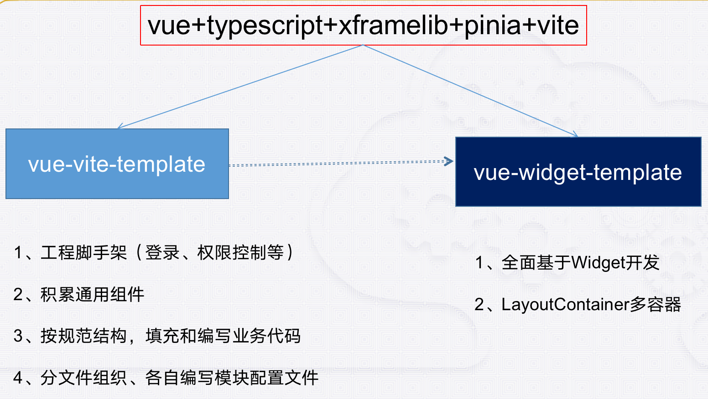
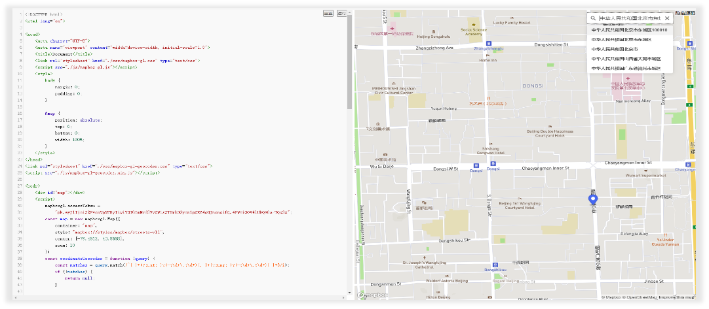

# 总体架构

## 1. 产品技术框架图

- 统一技术框架和模板
- 分层次解耦和积累
- 微服务、分布式
- 支持集群化和容器化
- 独立、自主、可控
- 符合国产化技术要求

 

***

## 2. 前端开发体系架构

看懂这两张图 能对这边前端整体研发思路 有个了解

 

***

# 开发框架

## 1. 开发工程模板

 

### 1.1 Widget 机制

> 我们现在都使用vue-widget-template开发模板，里面主要用的widget机制

 

1. import异步加载是H5标准，浏览器原生都支持的。
2. widget依赖链条和分组机制。
3. widget与菜单关联，深度递归下去。
4. widget受权限控制。
5. 事件调度 widget的加载和卸载。
6. 支撑建立各技术的widget组件例如cesium的一套，openlayers一套。
7. widget弹性可扩展，可以是个component，也可以是套业务单元，也可以是个功能单元，是一种更高级的代码复用方式。

 

***

## 2. 核心基础库xframelib

- 所有前端系统的内核，前端核心发动机
- 与Vue框架无关
- 开发经验成果积累
- 统一前端开发流程和规范

 

***

## 3. 空间GIS封装库xgis

 

 

***

## 4.代码生成工具

### 4.1 代码生成工具（Hprose）

> http://192.168.1.29/

 

### 4.2 代码生成工具（SwaggerAPI）

> http://192.168.1.29:81/

 

### 4.3 Hprose服务在线测试系统

***

## 5. API开发示例容器

 

***

# 基础支撑平台

## △ 成果资料容器

 

## 1. 用户权限管理系统

 

 

## 2. 图标在线服务和管理系统

 

1. 在线图标服务
2. 图标成果管理与复用
3. 可视化生成图标代码

 

## 3. 文件管理系统（基础版）

 

文件在线、分片、并发、断点续传
——大文件上传/下载

 

1. 服务于项目系统/产品
2. 按  系统 → 用户 组织
3. 文件分片上传/下载
4. 提供Web上传下载界面
5. 提供后台服务接口

 

## 4. 在线投影服务系统

 

## 5. 大图系统

 

***