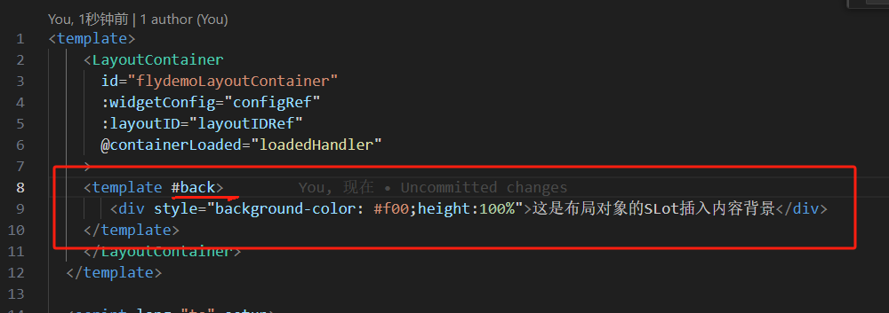
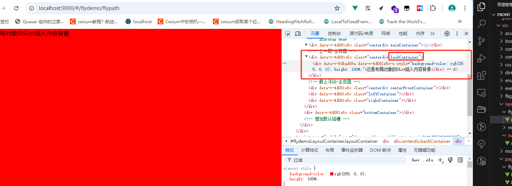
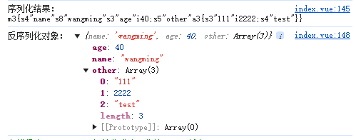
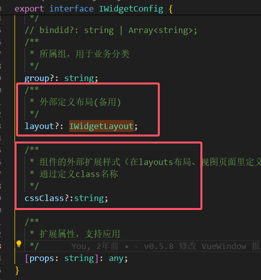
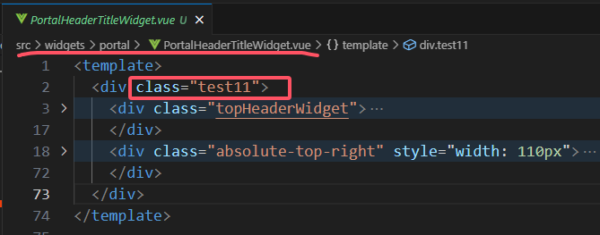

# xframelib核心库积累


## XFramelib前端基础库

>基于 VUE3+Hprose+Typescript 的前端框架，与ElementUI、AntDesign VUE等界面库无关，一直是来源于项目和服务于项目。


- 网站系统配置Sysconfig.js对应的Global.Config

- 公共事件总线Global.EventBus

- 整体系统日志Global.Logger()

- Layout布局容器和Widget机制实现

- Axios的Http请求封装实现Global.Axios、AxiosHelper{get, post, requestPost, requestGet, getData, requestPostBody} 

- Hprose Proxy方式调用后台Hprose服务实现

- 与用户系统后台服务适配的Token验证/刷新和角色权限过滤

- 大文件下载BigFileDownload

- 普通文件下载FileDownload封装{ Download, SaveAs, JsonDownload, HttpDownload, DownloadByUrl }

- 大文件上传FileUpload

- H5Tool常用小功能

- SignalrClient

- JQuery工具 （hasClass 、addClass、removeClass、toggleClass、setCssProperty）

- StorageHelper 本地缓存对象

- IsTool类型判断工具（数字、字符串、对象、数组、函数等）

- ValidateTool验证工具（身份证、手机号、IP地址、邮箱、密码强度判断、URL、车牌号等）

- 与后端配合使用的加密解密算法XXTE


##  xframelib使用知识点

### 0. Layout使用方法

#### 1）LayoutContainer使用，获取对应的LayoutManager

- 关闭加载动画，在onMounted中调用   **<u>Global.Loading('end');</u>**

- @containerLoaded 是处理和获取对应LayoutManager对象；内部会发送SysEvents.LayoutContainerLoaded，通知该LayoutContainer容器被加载

示例代码：

```vue
<template>
    <LayoutContainer
      id="flydemoLayoutContainer"
      :widgetConfig="configRef"
      :layoutID="layoutIDRef"
      @containerLoaded="loadedHandler"
    >
    </LayoutContainer>
  </template>
  
  <script lang="ts" setup>
  import { getRightWidgetConfig } from 'src/permission';
import { defineOptions,onMounted, onUnmounted, ref } from 'vue';
import { Global,LayoutContainer, LayoutManager } from 'xframelib';
  
  defineOptions({
    name: 'flydemoLayout'
  });
  
  const configRef = ref(getRightWidgetConfig());
  const layoutIDRef = ref('flydemoLayout');
  //要加载的Widget列表 
  const initWidgetIDs=["MapDemoWidget"];
  let layoutManager: LayoutManager;
  //获取服务此Layout的layoutManager
  function loadedHandler(evt: any) {
    layoutManager=evt.layoutManager;
    if(layoutManager)
    {
        initWidgetIDs.forEach(id=>{
            //加载组件
            layoutManager.loadWidget(id);
        });
    }
  }
 onMounted(()=>{
     //关闭加载动画
  Global.Loading('end');
 })
  onUnmounted(()=>{
    if(layoutManager)
    {   
        //卸载组件
        initWidgetIDs.forEach(id=>{
            layoutManager.unloadWidget(id);
        });
    }

  });
  </script>
  
  <style scoped lang="scss">
  :deep(.centerdiv) {
    pointer-events: none !important;
    >*{
      pointer-events:auto;
    }
  }
  </style>
  
```


#### 2）视图页面中获取对应的LayoutManger

监听SysEvents.LayoutContainerLoaded事件，传入参数为 {layoutID,layoutManager}。

> **注意**：首次加载时，视图可能先于LayoutManager构建出来，就需要使用监听方式

示例代码关键代码

```
import { OnEventHandler,OffEventHandler } from 'src/events';
import { onMounted, onUnmounted } from 'vue';
import { Global,LayoutManager,SysEvents } from 'xframelib';

let layoutManager: LayoutManager|undefined;
OnEventHandler(SysEvents.LayoutContainerLoaded,init);
function init(evt)
{
    if(evt.layoutID==='flydemoLayout')
    {
      load(evt.layoutManager);
      OffEventHandler(SysEvents.LayoutContainerLoaded,init);
   } 
}
```

完整视图实例代码：GameControl.vue

```
<template>
</template>
<script setup lang="ts">
import { OnEventHandler,OffEventHandler } from 'src/events';
import { onMounted, onUnmounted } from 'vue';
import { Global,LayoutManager,SysEvents } from 'xframelib';

  //要加载的Widget列表
const initWidgetIDs=["GameControlWidget",'KeyboardControlWidget','PanelDataWidget2'];
let layoutManager: LayoutManager|undefined;
OnEventHandler(SysEvents.LayoutContainerLoaded,init);
function init(evt)
{
    if(evt.layoutID==='flydemoLayout')
    {
      load(evt.layoutManager);
      OffEventHandler(SysEvents.LayoutContainerLoaded,init);
   } 
}
function load(layoutmanager:LayoutManager)
{
  layoutManager= layoutmanager;
        if(layoutManager)
        {
            initWidgetIDs.forEach(id=>{
                layoutManager?.loadWidget(id);
            })
        }
}
onMounted(()=>{
    layoutManager= Global.LayoutMap.get("flydemoLayout");
    if(layoutManager)
    load(layoutManager);
});
onUnmounted(()=>{
    OffEventHandler(SysEvents.LayoutContainerLoaded,init);
    if(layoutManager)
    {
      layoutManager?.unloadWidgets(initWidgetIDs);
    }
})
</script>
<style scoped></style>
```


#### 3）LayoutContainer的插槽应用

LayoutContainer的**具名插槽**有：**main、back、front、left、right、bottom**，默认插槽为 **default**

LayoutContainer容器代码（部分）如下：

```vue
<template>
  <div class="layoutContainer" :style="containerStyle">
    <div ref="topContainer" class="topContainer">
      <slot name="top"></slot>
      <component v-for="[key, item] in topContainerComponents" :ref="(el) => setItemRef(el, key)" :key="key" :is="item">
      </component>
    </div>
    <div>
      <!-- 主要容器-底部 -->
      <div ref="centerMainContainer" class="centerdiv mainContainer" v-if="isEnableRouterView">
        <slot name="main">
          <router-transition></router-transition>
        </slot>
      </div>
      <!-- 上一层-主容器 -->
      <div ref="centerBackContainer" class="centerdiv backContainer">
        <slot name="back"></slot>
        <component v-for="[key, item] in centerbackComponents" :ref="(el) => setItemRef(el, key)" :key="key" :is="item">
        </component>
      </div>
      <!-- 最上浮动-主容器 -->
      <div ref="centerFrontContainer" class="centerdiv centerFrontContainer">
        <slot name="front"></slot>
        <component v-for="[key, item] in centerfrontComponents" :ref="(el) => setItemRef(el, key)" :key="key"
          :is="item"></component>
      </div>

      <div ref="leftContainer" class="leftContainer">
        <slot name="left"></slot>
        <component v-for="[key, item] in leftContainerComponents" :ref="(el) => setItemRef(el, key)" :key="key"
          :is="item"></component>
      </div>

      <div ref="rightContainer" class="rightContainer">
        <slot name="right"></slot>
        <component v-for="[key, item] in rightContainerComponents" :ref="(el) => setItemRef(el, key)" :key="key"
          :is="item"></component>
      </div>
    </div>
    <div ref="bottomContainer" class="bottomContainer">
      <slot name="bottom"></slot>
      <component v-for="[key, item] in bottomContainerComponents" :ref="(el) => setItemRef(el, key)" :key="key"
        :is="item"></component>
    </div>
    <!-- 增加默认插槽 -->
    <slot name="default"></slot>
  </div>
</template>
```


- **具名插槽back使用**

  

  

- **示例代码**：

```vue
<template>
    <LayoutContainer
      id="flydemoLayoutContainer"
      :widgetConfig="configRef"
      :layoutID="layoutIDRef"
      @containerLoaded="loadedHandler"
    >
    <template #back>  
       <div style="background-color: #f00;height:100%">这是布局对象的SLot插入内容背景          </div>
    </template>
    </LayoutContainer>
  </template>
  
  <script lang="ts" setup>
  </script>
  
  <style scoped lang="scss">
  :deep(.centerdiv) {
    pointer-events: none !important;
    >*{
      pointer-events:auto;
    }
  }
  </style>
  
```


### 1. V0.7.7之前通用知识点

#### 1）Widget组件如何才能支持“隐藏”和“打开”——可见性控制
 *widget需要对外暴露 isShow属性 和 changeVisible方法*
-  可见性控制的Widget模版代码

 ``` vue
 <template>
    <div v-show="isShow">
        <span>能支持“隐藏”和“打开”——可见性控制的Widget示例模版</span>
    </div>
</template>
<script lang="ts" setup>
import { onMounted, ref } from 'vue';
onMounted(() => {

})
/**
 * 对外暴露接口
 */
const isShow = ref(true);
function changeVisible(isVisible: boolean = false) {
    isShow.value = isVisible;
}
defineExpose({ changeVisible, isShow });
</script>
<style lang="scss" scoped></style>
 ```

#### 2）监听后续Widget组件是否加载了

import { SysEvents} from 'xframelib';

 import {OffEventHandler,OnEventHandler} from 'src/events/index';   

  OnEventHandler(SysEvents.WidgetLoadedEvent,onWidgetLoaded);

          function onWidgetLoaded(evt2)
          {
            if(evt2.layoutID===_LayoutID&&evt2.widgetID===_widgetID)
              {
                //TODO:做事情
                OffEventHandler(SysEvents.WidgetLoadedEvent,onWidgetLoaded);
              }
          }
          OnEventHandler(SysEvents.WidgetLoadedEvent,onWidgetLoaded);


#### 3）使用Hprose的序列化与反序列化

Hprose序列化协议规范：https://github.com/hprose/hprose/tree/master/3.0

https://github.com/hprose/hprose/blob/master/3.0/Hprose%203.0%20%E5%BA%8F%E5%88%97%E5%8C%96%E5%8D%8F%E8%AE%AE%E8%A7%84%E8%8C%83.mediawiki

建议：使用Hprose的序列化取代JSON序列化

原因：

- 1、类似二进制的，数据量小，更安全 
- 2、保持类型不变，跨语言的  (json虽然也跨语言，但不同语言解析出来的有差异，导致类型丢失或类型转换错)

使用方法：

```typescript
import { deserialize, serialize } from 'xframelib';

const testObj={
  "name": "wangming",
  "age": 40,
  "other": [
    "111",
    2222,
    "test"
  ]
};
//序列化
const result=serialize(testObj);
console.log('序列化结果：',result);
//反序列化对象
const obj=deserialize(result);
console.log('反序列化对象：',obj);
```

结果如下：



#### 4）H5Tool中复制文本

**H5Tool支持的复制文本方法**

- **copyTextByCommand** （旧方式，用的技术 <u>document.execCommand('copy');</u>）
- **copyText**     （新方式，使用navigator.clipboard.writeText）
- **copyElementTextByCommand**   （旧方式，通过节点复制文本）
- **copyElementText**    （新方式）


### 2. V0.7.8新增的

#### 1） Global.getLayoutManager通过WidgetID反向获取LayoutManager

Global.WidgetConfigList存储所有的WidgetSetting，在开发模版的src/permission/index.ts的getRightWidgetConfig()方法里进行的初始化


通过WidgetID反向获取LayoutManager

```typescript
        const tmpLayoutManager = Global.getLayoutManager(widgetID.value);
        tmpLayoutManager?.changeWidgetVisible(widgetID.value, true);
```

#### 2）XWindow组件如何使用

vue仿win窗口实现悬浮窗拖动，调整大小，最大化，复原。
- 同类开源工程和示例

  https://github.com/mxywds/vue-float-window-pro

  https://vue-float-window-pro.pages.dev/

  

  https://github.com/AshOnDiscord/floatingVueWM

- 对外暴露的属性字段

  ```
  {
      top: {
          type: (StringConstructor | NumberConstructor)[];
          default: number;
      };
      left: {
          type: (StringConstructor | NumberConstructor)[];
          default: number;
      };
      nWidth: {
          type: (StringConstructor | NumberConstructor)[];
          default: string;
      };
      nHeight: {
          type: (StringConstructor | NumberConstructor)[];
          default: string;
      };
      icon: {
          type: StringConstructor;
          default: string;
      };
      title: {
          type: StringConstructor;
          default: string;
      };
      titleHeight: {
          type: (StringConstructor | NumberConstructor)[];
          default: string;
      };
      hasMin: {
          type: BooleanConstructor;
          default: boolean;
      };
      hasMax: {
          type: BooleanConstructor;
          default: boolean;
      };
      hasClose: {
          type: BooleanConstructor;
          default: boolean;
      };
      isDark: {
          type: BooleanConstructor;
          default: boolean;
      };
      pid: {
          type: StringConstructor;
          default: string;
      };
      tag: {
          type: (StringConstructor | NumberConstructor | ArrayConstructor | ObjectConstructor)[];
          default: string;
      };
  }
  ```

- 对外暴露的事件

  ("close" | "open" | "loaded" | "minimize"}

- 使用示例

  **import { XWindow, XWindowManager,WindowsMap,MinWindowMap } from 'xframelib';**

  ```
  <template>
      <XWindow v-show="isShow" top="10px" left="10px" nWidth="300px" nHeight="400px" title="XWindowWidget模版"
          icon="img/basicimage/arcgis_img.png" :hasMax="true"pid="widgetID"  @loaded="loadedHandle" @close="doClosePanel">
          <span>这是XWindowWidget模版，窗体的内容示例</span>
      </XWindow>
  </template>
  ```

  #### 3）SysConfig.UI.Theme主题样式支持
  
  
  #### 4）SysConfig.Enables控制外部资源动态引入
 ```
   //#region **********用于控制功能是否启用
  Enables:{
    TurfAsync:true,
    CesiumOfflineCache:true,//Cesium缓存
  }
  //#endregion
 ```
 在App.vue的onBeforeMount()函数里添加控制代码
 

 - TurfAsync 异步函数库是否启用

 ```
 	   //参考：https://github.com/zorrowm/turf-async
 	    //启用turfAsync
 	    if(Global.Config.Enables.TurfAsync)
 	    {
 	      loadScript('./js/turf-async/index.js');
 	    }
 ```

 - Cesium离线缓存功能是否启用

 ```
 	     //启用Cesium缓存
 	    if(Global.Config.Enables.CesiumOfflineCache)
 	    {
 	      loadScript('./js/CesiumOfflineCache.min.js');
 	    }
 ```
在CesiumViewerWidget.vue里，setup中启用cesium缓存功能

```
    //参考：https://github.com/zorrowm/CesiumOfflineCache
    if (Global.Config.Enables.CesiumOfflineCache) {
      (window as any).CesiumOfflineCache?.ruleList?.add('*');
    }
```

### 3. V0.7.9

#### 1）每个LayoutManager对象自动加载到Global.LayoutMap里
旧LayoutContainer代码


新代码示例——节选，也可以去掉containerLoaded事件监听
```
<template>
  <div class="dc-container">
    <LayoutContainer :widgetConfig="configRef" :layoutID="layoutIDRef" />
  </div>
</template>

<script lang="ts">
import { getRightWidgetConfig } from 'src/permission';
import { appStore } from 'src/stores';
import { defineComponent, onMounted, ref } from 'vue';
import { Global, H5Tool, LayoutContainer } from 'xframelib';

export default defineComponent({
  name: 'bigScreenLayout',
  components: {
    LayoutContainer
  },
  setup(props, { attrs, slots, emit }) {
    const widgetCofig = getRightWidgetConfig();
    const configRef = ref(widgetCofig);
    const layoutIDRef = ref('bigScreenLayout');
    //获取服务此Layout的layoutManager
    // function loadedHandler(evt: any) {
    //   if (evt.layoutID === layoutIDRef.value) {
    //     //Global.Logger().debug(evt, 'loadedHandler');
    //     Global.LayoutMap.set(evt.layoutID, evt.layoutManager);
    //   }
    // }
```
####  2)监听SysEvents.LayoutContainerLoaded来判断LayoutManager已经构建

> ​    OnEventHandler(**SysEvents.LayoutContainerLoaded**, initHandler);  来监听判断LayoutContainer已经加载好了。（主要用于LayoutContainer放在Widget里做容器时）

示例代码如下：
```
<template>
  <TransitionSlide enter="fadeInUp" leave="fadeOutUp">
    <APIExamplePanel v-if="apiExamplesList" :data="apiExamplesList" @contentItemClicked="doItemClickHandler" />
  </TransitionSlide>
</template>

<script setup lang="ts">
import APIExamplePanel from 'components/Quasar/APIExample/index.vue';
import TransitionSlide from 'components/TransitionSlide.vue';
import { onMounted,ref } from 'vue';
import {  Global, LayoutManager, SysEvents } from 'xframelib';
import { useRoute, useRouter } from 'vue-router';
import { OffEventHandler, OnEventHandler } from 'src/events';
import SystemsEvent from 'src/events/modules/SystemsEvent';

const route=useRoute();
const router = useRouter();
const apiExamplesList = ref<any[]>();
//异步加载数据
import('src/settings/apiExampleSetting/cesium/index').then((p) => {
  apiExamplesList.value = p.default;
});

let currentItem:any;
let layoutManagerExamples: LayoutManager;
//新的容器widget
const layoutWidgetID = 'frontLayoutWidget';
function initHandler(data)
{
  if(Global.LayoutMap.has(layoutWidgetID))
  {
    layoutManagerExamples = Global.LayoutMap.get(layoutWidgetID);
    OffEventHandler(SysEvents.LayoutContainerLoaded, initHandler);
    cesiumLoadedHandler();
  }
}

function cesiumLoadedHandler()
{
  if(layoutManagerExamples&&currentItem?.path)
  {
    console.log('开始加载：',currentItem.path)
      layoutManagerExamples.loadWidget(currentItem.path);
  }
  else
  {
    console.log('失败加载：',currentItem.path)
  }
}

function doItemClickHandler(it) {
  currentItem=it;
  //主页面的LayoutManager
  const mainlayoutManager: LayoutManager = Global.LayoutMap.get('productLayout');

  if(route.query?.wid!=it.path)
    router.push({query:{wid:it.path}});

  if (!mainlayoutManager.isWidgetLoaded(layoutWidgetID)) {
  
    OnEventHandler(SysEvents.LayoutContainerLoaded, initHandler);
    mainlayoutManager.loadWidget(layoutWidgetID).then(() => {
       //首次直接加载
      console.log('首次直接加载',layoutWidgetID);
      //首次直接加载
    });
  } else {
    layoutManagerExamples = Global.LayoutMap.get(layoutWidgetID);
    if (layoutManagerExamples) {
      let isExist = false;
      const excludeWidgetIDs = ['cesiumWidget', it.path];
      layoutManagerExamples.unloadAllWidgets(excludeWidgetIDs);
      isExist = layoutManagerExamples.isWidgetLoaded(it.path);
      if (!isExist) {
        //没有加载，则加载
        layoutManagerExamples.loadWidget(it.path);
      } else {
        console.log('让widget可见');
        layoutManagerExamples.changeWidgetVisible(it.path, true);
      }
    }

    mainlayoutManager.getWidgetComponent(layoutWidgetID).changeVisible(true);
  }
}

onMounted(()=>{
  const wid=route.query?.wid;
  if(wid)
  {
    setTimeout(() => {
      doItemClickHandler({path:wid});
    }, 500);

  }
})
</script>

```

#### 3）强化Widget链式排队加载，通过afterid实现顺序加载

> 通过SysEvents.WidgetLoadedEvent实现，等待父组件加载后，再加载当前子组件，实现链式依赖的顺序加载

核心代码片段如下：
```
 {
          const self=this;
          const afterID=widgetTarget.afterid;
          const laterWidget=widgetTarget;
          function onWidgetLoaded(evt2)
          {
            if(evt2.layoutID===self._LayoutID&&evt2.widgetID===afterID)
              {
                self._loadWidget(laterWidget);
                // console.log('0000晚加载widget',laterWidget);
                Global.EventBus.off(SysEvents.WidgetLoadedEvent,onWidgetLoaded);
              }
          }
          Global.EventBus.on(SysEvents.WidgetLoadedEvent,onWidgetLoaded);
          return this.loadWidget(widgetTarget.afterid);
        }
```

#### 4)为H5Tool增加DOM操作方法等

H5Tool新增相关方法如下
- getRandomNum 获取范围内的随机数
- formatNum 格式化小数
- trim 去除空格
- splitWords 按空格分割字符串
- emptyImageUrl
- debounce、throttle
-   create DOM创建
-   getStyle 获取样式
-  removeElement 移除元素
-   addClass、removeClass、setClass，添加移除class
-  createSvgElement创建SVG要素

### 4. V0.8.0

#### 1)统一修改各层样式

> 统一修改各层样式，默认空白区域鼠标可以穿越，各元素鼠标可点击

默认各层容器样式改为，例如：

```
.leftContainer {
  position: absolute;
  top: 0px;
  left: 0px;
  z-index: var(--layout-left-zindex);
  height: 100%;
  pointer-events: none;
  >* {
    pointer-events: all !important;
  }
}
```

### 5. V0.8.1

#### 1)增加RouterTransitionAnimate组件

> 增加具有默认动画的RouterTransitionAnimate组件
>
> RouterTransitionAnimate支持视图切换时，自带动画效果，也可以修改设置动画效果

该组件的代码为：

```
<template>
  <SuspenseWithError>
    <router-view v-slot="{ Component, route }">
      <transition-group appear
        :enter-active-class="enterActive"
        :leave-active-class="leaveActive"
      >
        <keep-alive >
          <component v-if="route.meta.keepAlive"  :is="Component"  :key="route.name" />
        </keep-alive>
        <component  v-if="!route.meta.keepAlive" :is="Component" :key="route.name" />
      </transition-group>
    </router-view>
  </SuspenseWithError>
</template>

<script lang="ts" setup>
import SuspenseWithError from './SuspenseWithError.vue';
defineOptions({ name: 'RouterTransition' });
interface Props {
    enterActive?: string;
    leaveActive?:string;
}
//参考：https://quasar.dev/options/animations#usage
const props = withDefaults(defineProps<Props>(), {
  enterActive:"animated fadeIn",
  leaveActive:"animated fadeOut"
});
</script>
```

#### 2)widget配置支持外部配置样式（重要）

> widget配置对象（IWidgetConfig）启用layout属性（IWidgetLayout布局样式），增加cssClass外部配置样式类

IWidgetConfig配置接口对象，变化的两个属性：



- **应用示例**

以前端开发模板里的 <u>src/widgets/portal/PortalHeaderTitleWidget.vue</u>为例



1. 给Widget配置外部布局和CSS样式

   ```
   /**
    * 组件配置项
    */
   const defaultWidgetCofig: Array<IWidgetConfig> = [
     {
       layoutID: 'portalLayout', //归属组
       id: 'HeaderTitleWidget',
       label: '头部栏',
       container: LayoutContainerEnum.top,
       component: () => import('src/widgets/portal/PortalHeaderTitleWidget.vue'),
       preload: true,
       layout:{
         top:30,
         left:10,
         width:"100%",
         height:"30px",
         background:"#f00"
       },
       cssClass:"a1 a2"
     },
   ```

   

2. 在Layout或对应视图里定义类名为a1、a2的样式

   

3. 加载后效果——外部样式应用

   


### 6. V0.8.2

>  修改VueWindow组件（VWindow）拖动定位错误;弃用DownloadByUrl方法;移除窗体同步库WSynchro.js;更新依赖库版本;

**重点：** **修改VueWindow组件（VWindow）拖动定位错误**

### 7. V0.8.3 

> v0.8.3  增加HproseRPC过程的请求字符串和返回字符串的外部解码类HproseRPCCodec;

* 对HproseRPC过程的 request和response进行反序列化

```ts
function doDecodeRPC()
{
    const responseHeader={};
    if(rpcvalue.value==='request')//请求
    {
        rpcResult.value= HproseRPCCodec.Instance.decodeRequest(rpcInfo.value,responseHeader);
    }
    else //返回结果字符串
    {
        rpcResult.value= HproseRPCCodec.Instance.decodeResponse(rpcInfo.value,responseHeader);
    }
    console.log('解码请求头:',responseHeader);
}
```
http://localhost:9000/#/back/hprose-encode


### 8.  V0.8.4

> v0.8.4  为widget权限对象，增加layoutid属性;修改LockHelper锁屏功能BUG;去掉DownloadByUrl（可改用HttpDownload方法）;为H5Tool增加readFileBytes方法（读取前端文件，为bytes二进制数组/字符串）;更新依赖库版本;


* **H5Tool.readFileBytes方法**:实现前端读取要上传文件File对象，为bytes二进制数组/字符串，再用post方法上传。

```vue
    <q-uploader ref="profileUploader2" :max-files="1" class="hidden"  accept=".doc, .docx, .pdf"
    field-name="file" @added="UploadFileToProfile" />
```

UploadFileToProfile上传文件代码

```typescript
//单附件文件上传
async function UploadFileToProfile(files) {
  const file = files[0];
  const fileName=file.name;
  //***文件二进制内容******
  const data=await H5Tool.readFileBytes(file);
  const result = await ProfileService.SaveProfileInfoAsync(
    //@ts-ignore
  {
      id:'',
      file:data,
      name:fileName,
      studentid:currentSelectId,
  }
  );
  profileUploader2.value?.reset();
  if(result){
    Global.Message.info('档案上传成功！')
    query();
    return;
  }
  Global.Message.info('档案上传失败！')
}
```

*ProfileService.SaveProfileInfoAsync方法内容*

```ts
    /**
    *新建或更新档案 
    *@param profile  档案对象 
    *@returns System.Threading.Tasks.Task`1[System.Boolean]
    */
    async SaveProfileInfoAsync( profile?:Profile)
    {
      const proxyClient=await this.hproseProxyClient.getHproseProxy();
      if(!proxyClient)
      {
        console.warn('ProxyClient为空,SaveProfileInfoAsync方法无法调用');
      }
      
      return await proxyClient?.SaveProfileInfoAsync(profile);
    }
```

### 9.V0.8.5

>  动态加载Widget时绑定更多IWidgetConfig属性（如：id,layoutID等）;加载widget报错，输出更多异常信息;

widget组件运行时，获取自身的options属性

```ts
import { getCurrentInstance } from 'vue';     
const instance = getCurrentInstance();
console.log('5555555555',instance?.proxy?.$options)
```

**就是组件里可以拿到当前运行时的widget id和 layoutID,可用于内部卸载Widget自身。**


测试卸载Widget自身：成功

```ts
      const instance = getCurrentInstance();
      const wid=instance?.proxy?.$options.id;
      const layoutid=instance?.proxy?.$options.layoutID;
      setTimeout(() => {
        console.log('开始卸载自身');
        if(wid)
        Global.LayoutMap.get(layoutid)?.unloadWidget(wid);

      }, 2000);
```

### 10. V0.8.6

> 修改get方法支持：业务服务API请求、请求网站public下资源、http完整URL请求; 

之前的get方法是请求相对于SysConfig.js的ServiceURL下DefaultWebAPI后台服务的相对地址APIURL，但被广泛用于请求前端的相对资源的请求，这在之前是错误的用法。

**从v0.8.6版，get方法支持：业务服务API请求、请求网站public下资源、http完整URL请求;* 

```ts
/**

 * 业务服务Get请求、请求网站下资源、http完整请求
 * @param url public下资源相对路径
 * @param _params 参数
 * @param isForceAPI 是否强制为API请求，默认false
 * @returns 返回Promise对象
   */
 declare function get(url: string, _params?: any, isForceAPI?: boolean): Promise<any>;
```

get方法应用：
请求完整URL

```ts
  get('https://file.gis.digsur.com/swagger/v1/swagger.json').then(p=>{
      console.log('请求结果:',p);
        if(p.data)
        JsonDownload(p.data,'test')
    }).catch(()=>{
        Global.Message.warn('下载错误');
    })
```

请求网站相对资源
```ts
   get('SampleData/README.md').then(p=>{
         if(p.data)
         SaveAs(p.data,'test.md');
     })
```

请求后端API服务
```
   get('/api/Grade/GetGradeList',undefined,true)
```

### 11. V0.8.7

> 修改0.8.6版的getDownload内部错误（与HttpDownload方法共存使用）;

使用示例：

```
 getDownload('./SampleData/README.md');
 
 getDownload('https://file.gis.digsur.com/swagger/v1/swagger.json');
 
  getDownload('https://file.gis.digsur.com/swagger/v1/swagger.json','2.json');
```

### 12. V0.8.9

> 为Function扩展promise方法（事件异步方法将按Promise异步执行）；修改isElement判断错误；增加ZipTool用于文件在线压缩和解压；H5Tool增加blockEvent停止冒泡bindDropFileHanlder拖拽文件、readFilePromise异步读取文件、优化readFileBytes为bytes二进制数组;IsTool增加isStringLikeJson、isStringLikeKml方法;H5Tool增加了onPasteHandler和offPasteHandler使用document绑定粘贴事件（不是任意div元素都可以绑定paste事件，只有设置了 contenteditable="true" 的元素，才会触发该事件）；FileDownload增加SaveToSelectedFile方法，将文件保存到选定路径；

1. 为Function扩展promise方法

   实现事件方法以Promise异步方式执行

    **readFile.promise**

   ```ts
        if (isFunction(readFile.promise))
           readFile.promise(event.dataTransfer.files[0], '1111111111').then(p => {
             console.log('8888888888', p);
           });
   ```

   事件回调方法，例如：

   ```ts
   function readFile(file: File, msg: string, cb: Function) {
     var reader = new FileReader();
     console.log('5555555555')
     reader.onload = function (e) {
       try {
         console.log('结果:',reader.result);
         cb(null, reader.result)
       } catch (error) {
         cb(error)
         console.error('加载 Shapefile 失败:', error);
       }
     };
     reader.readAsText(file)//readAsArrayBuffer(file);
   }
   ```

   H5Tool的promisify使用,例如：

   ```ts
   const data=await H5Tool.promisify(readFile,event.dataTransfer.files[0],'11111111')
   ```

   

2. bindDropFileHanlder拖拽文件

   >  /**
   >
   >   \* 给DIV对象绑定拖拽文件事件
   >
   >   \* @param ele id或classname或 HtmlElement对象
   >
   >   \* @param onDropFile 接收文件拖拽列表_回调函数
   >
   >   */
   >
   >  static bindDropFileHanlder(ele:string|Element,onDropFile:(fileList:FileList)=>{})

   给id为map的div增加拖拽文件加载事件

   ```ts
       //拖拽文件加载
       H5Tool.bindDropFileHanlder("map",dragFileHandler);
   ```

   拖拽文件处理方法：

   ```ts
   async function dragFileHandler(fileList: FileList) {
     if (!fileList || fileList.length === 0)
       return;
     {
       const len = fileList.length;
       console.log('文件个数为：', len);
       const files = Array.from(fileList) 
     }
   }
   ```

   

3. readFilePromise异步读取文件

   >   /**
   >    * 以Promise方式读前端文件
   >
   >    * @param file 文件或BLob
   >
   >    * @param type 类型'FileBytes'|'ArrayBuffer'|'Text'|'BinaryString'|'DataURL'，默认为ArrayBuffer
   >
   >    * @param encoding 文本编码,默认为UTF-8
   >
   >    * @returns 
   >
   >    * */
   >       
   >    static readFilePromise(file:File|Blob, type:'FileBytes'|'ArrayBuffer'|'Text'|'BinaryString'|'DataURL'= 'ArrayBuffer',encoding="UTF-8"):Promise<string|ArrayBuffer> 

   示例代码：**H5Tool.readFilePromise(file,'Text')**

   ```ts
   async function fileUpload(files) {
     const file = files[0];
     const name = file.name;
   
     const data=await H5Tool.readFilePromise(file,'Text') as string;
     const json=JSON.parse(data);
     plotHelper.addFeatures(json);
   }
   ```

   ```ts
   /**
    * 读取前端文件，为bytes二进制数组（base64编码的）
    * @param file 
    * @returns 
    */
   static readFileBytes(file:File|Blob):Promise<any>
   {
     return H5Tool.readFilePromise(file,"FileBytes");
   }
   ```

   

4. H5Tool增加了onPasteHandler和offPasteHandler使用document绑定粘贴事件

   > 不是任意div元素都可以绑定paste事件，只有设置了 contenteditable="true" 的元素，才会触发该事件

   ```ts
       H5Tool.onPasteHandler(pasteFileHandler);
   
   async function pasteFileHandler(copyContent: string | File[]) {
     if (isString(copyContent)) {
       Global.Message.info(copyContent as string);
     } else if (Array.isArray(copyContent)) {
       const files = copyContent as File[];
       if (files.length === 0) return;
       const result = await import2DFiles(files);
       if (result && result.length > 0) {
       }
     }
   }
   ```

   

5. FileDownload增加SaveToSelectedFile方法

> 可能报“window.showSaveFilePicke个不存在”问题
> handle = await window.showSaveFilePicker(options);


### 13. V0.9.0


1. iconv字符编码使用

   ```ts
   import { iconv } from 'xframelib';
   
   //字符转编码
        const utf8Str='ÁÖ»¶4ÔÂÔ±¨.docx';
       const tmp =iconv.encode(utf8Str,"ISO-8859-1")
       const gb2312 = iconv.decode( tmp,'gbk')
       console.log('5555555',gb2312);
   ```

   

   

   

   沙发是

2. **ZipTool用于文件在线压缩和解压**

- 解压文件

直接读取压缩包文件，解压：readZipFromFile

readZipFromFile

```ts
   const zipfile=fileList[0];
   const result=await ZipTool.readZipFromFile(zipfile);
   fileArray.value=result.map(it=>it.filename);
   result.forEach(it=>{
    SaveAs(it.content,it.filename);
   })
```


- 压缩文件

saveZipFile、saveZipFromFiles、saveZipFileSync方法

```ts
 const files=Array.from(fileList);
    ZipTool.saveZipFromFiles('0000.zip',files);
    const list=[];
    for(let i=0;i<files.length;i++)
    {
        const file=files[i];
        const filename=file.name;
      const buffer= await H5Tool.readFilePromise(file,'ArrayBuffer');
      const content=new Uint8Array(buffer);
      list.push({
        filename,content
      })
    }

    ZipTool.saveZipFile('22222.zip',list);
    const tt=ZipTool.saveZipFileSync('33333.zip',list);
    console.log('压缩0000',tt);
    }
```
