# vue-widget-quasar-clivite-template开发模板

> vue-widget-quasar-clivite-template核心是基于VUE的Widget机制开发框架，使用quasar作为UI库，通过quasar-cli和Vite结合方式进行前端工程编译打包。

​	与现在的vue-widget-tempalte相比较，目录组织机构相同（views改为pages)，Widget插件机制相同，只是在UI库方面由AntDesign转为Quasar，打包编译配置和插件基本相同，都利用了vite。

## 主要优势

- 基于项目经验积累的与界面无关的前端基础库xframelib
- Layout多层次布局（上下左右，中间前后三层）
- Widget动态加载卸载、可配置可复用机制
- WidgetMenu可配置菜单机制
- 基于Iconify标准的在线图标和离线图标
- 系统路由MenuRoutes.json自动生成与手动注册/更新
- 统一的用户角色权限控制
- 内部已经积累的组件、指令和布局模版（后台、大屏、门户等）
- 配套积累常用代码片段CodeSnippets
- Quasar更强大UI和样式适配特性

## 为什么选择Quasar

1. **官方理由：**

- 基于Vue.js
- 开箱即用的提供给**网站**和**应用程序**的最先进的UI（遵循《Material指南》）
- 开箱即用的对桌面和**移动浏览器**（包括iOS Safari！）的最佳支持
- 通过与我们自己的CLI紧密集成，对每种构建模式（SPA、SSR、PWA、移动应用程序、桌面应用程序和浏览器扩展）提供了一流的支持，并提供了最佳的开发人员体验
- 易于自定义（CSS）和可扩展（JS）
- 这是最注重性能的框架
- 自动tree shaking

------

2. **个人理由：**


- AntDesign仅仅是个好用的Web组件UI库，但Quasar不仅有组件且兼容支持Web、移动应用程序、桌面应用程序和浏览器扩展（一体化解决），而且有指令、组合函数、插件等。

  

- Quasar组件粒度小，大部分组件可以互相嵌套灵活组合，形成万变变化（类似积木）

- Quasar自带常用/好用的间距、阴影、断点以及可见性和定位等样式，特别是断点广泛适用，大大降低多屏适配的工作量

- Quasar指令超级实用好用

  

## 全面基于Widget开发

Widget 机制


> 我们现在都使用vue-widget-template开发模板，里面主要用的widget机制

<br>

1. import异步加载是H5标准，浏览器原生都支持的。
2. widget依赖链条和分组机制。
3. widget与菜单关联，深度递归下去。
4. widget受权限控制。
5. 事件调度 widget的加载和卸载。
6. 支撑建立各技术的widget组件例如cesium的一套，openlayers一套。
7. widget弹性可扩展，可以是个component，也可以是套业务单元，也可以是个功能单元，是一种更高级的代码复用方式。


## vue-widget-quasar开发模板

### 初始配置

npm install 后需要对@quasar/app-vite的vite版本进行单独升级（默认版本太旧）

quasar-vite升级.png

### 目录结构


--public  不打包全局资源

​	--css 公共全局样式

​	--img 图片资源
​	--js  js库

​	--SysConfig.js 网站系统配置，主要

--src

​	--actions

​	--api  根据后台WebAPI服务自动生成的前端代码

​	--assets 图片和css等资源（参与打包）

​	--boot 系统初始化、挂接全局资源的（不用修改）

​	--components 自带的通用基础组件

​	--composables 类似VueUse库包装

​	--css   css变量；主题CSS

​	--directives 积累的指令

​	--enums  枚举变量

​	--enents 定义各类事件，按模块划分组织

​	--examples 自带组件使用示例

​	--layouts 各种布局页面，每个布局也都优先使用基于<LayoutContainer>方式

​	--models公共模型对象

​	--netAPI 网络服务AIP调用，IP查询、QQ定位、天气状况

​	--pages 按布局layout名称定义不同的文件夹，组织视图页面

​	--permission 角色权限过滤的相关方法

​	--router 按布局layouts名划分组织定义路由；路由守卫

​	--service  通过后台hprose服务生成的业务服务TS代码

​	--settings  设置项，modal对话框设置，widgetMenu设置，widget设置，函数设置，project设置

​	--stores    按业务模块组织pinia 公共数据层

​	--utils  通用工具方法

​	--widgets 按Layout名定义不同的文件夹，组织业务组件Widgets

​        --workers 编写异步函数方法，都会编译成一个webworke

### SysConifg.js解析

SysConfig.js是在XFramelib初始化时全局挂接到 Global.Config对象上的,对应模型为ISystemConfig，**<u>一二级配置项都具有自定义扩展能力。</u>**

```typescript
export interface ISystemConfig {
  /**
   * 用户界面配置
   */
  UI: IUIObject;
  /**
   * 服务URL
   */
  ServiceURL: IServiceURL;
  /**
   * 地图相关Keys
   */
  MapKeys?: IMapKeys;
  /**
   * API服务路径
   */
  APIPath?: object; //
  //其他配置信息
  [props: string]: any;
}
```

UI为默认系统界面相关配置，对应模型为IUIObject,选项具有可扩展能力。

```typescript

export interface IUIObject {
  /**
   * 网站标题
   */
  SiteTitle: string;
  /**
   * 系统的所属组名
   */
  Group?: string;
  /**
   * 版权
   */
  CopyRight: string; //'Copyright ©XXX  2021-2025',
  /**
   * 官方链接
   */
  WebSite?: string; //网站链接
  /**
   * 超时锁屏时间(单位：秒s)
   * 自动锁屏时间，为0不锁屏。
   */
  LockTime?: number; //
  /**
   * 是否是能访问互联网，还是内网部署应用
   * */
  IsInternet?: boolean;

  /**
   * 网站灰色模式，用于可能悼念的日期开启
   * 默认为false
   */
  GrayMode?: boolean;

  /**
   * 其他扩展的属性
   */
  [props: string]: any;
}
```

ServiceURL 为默认后台服务地址配置，可自定义扩展字段。

```typescript
export interface IServiceURL {
  /**
   * 用户登录验证服务（统一用户登录:后台）
   */
  LoginAuthURL?: string; //用户验证
  /**
   * 用户登录界面（统一用户登录界面:前台）
   */
  UILoginURL?: string;//用户登录界面
  /**
   * 文件管理服务地址（统一文件管理：后台）
   */
  FileServiceURL?: string; //文件管理
  /**
   * 文件管理（统一文件管理：前台）
   */
  UIFileURL?: string; //文件管理，在线
  /**
   * 在线日志服务（统一日志记录）
   */
  LogServiceURL?: string;
  /**
   * 图标在线服务地址
   */
  IconServiceURL?: string;
  /**
   * Axios普通WebAPI的BaseURL
   * 全局默认的http请求地址（一般与主hprose相同或不同）;文件上传地址
   */
  DefaultWebAPI?: string;
  /**
   * 默认HproseAPI的服务地址
   */
  DefaultHproseAPI?: string;
  /**
   * 其他扩展的URL属性
   */
  [props: string]: any;
}
```

MapKeys 为全局设置地图服务的KEYS,可以单个KEY或数组,对应模型为IMapKeys

```typescript
export interface IMapKeys {
  /**
   * 天地图Key ,单个或数组
   */
  TDTKey?: string|string[];
  /**
   * MapboxKey ,单个或数组
   */
  MapboxKey?: string|string[];
  /**
   * Cesium Key ,单个或数组
   */
  CesiumKey?: string|string[];
  /**
   * Google地图Key ,单个或数组
   */
  GoogleKey?: string|string[];
  /**
   * 其他扩展的Key属性
   */
  [props: string]: any;
}
```

APIPath 为配置API服务的相对路径，与ServiceURL里的选项配合使用，字段名称和值自定义。


### 系统注册/更新

每个新项目系统要修改package.json的name和version，name和version共同作为唯一确认系统的ID。

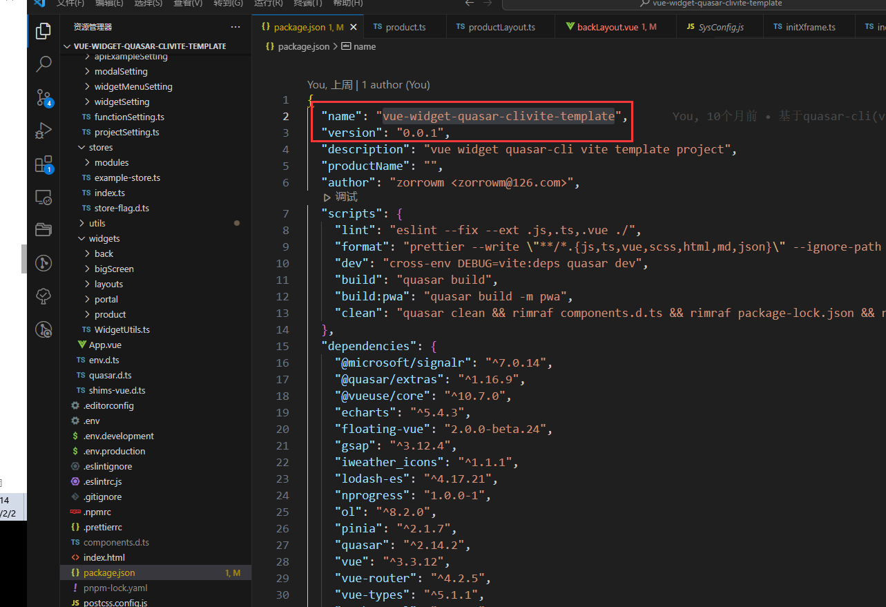

开发模式下，每次系统运行，会在Public目录下生成MenuRoutes.json或 /help/register请求来生成系统元数据JSON。

[基于widget Quasar-cli开发模板](http://localhost:9000/#/help/register)

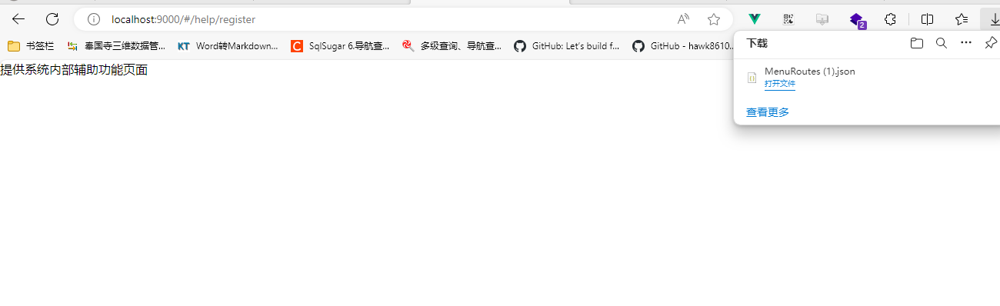

```
{
  "id": "fbe867c7bd3c208c41791a2e0e38c7fe",
  "name": "基于widget Quasar-cli开发模板",
  "product": "vue-widget-quasar-clivite-template",
  "version": "0.0.1",
  "routes": [
    {
      "path": "/default",
      "name": "DefaultLayout",
      "type": 0,
      "children": [
        {
          "path": "home",
          "name": "home2",
          "title": "首页2",
          "type": 0,
          "index": 1
        },
        {
          "path": "dashboard",
          "name": "dashboard2",
          "title": "仪表盘",
          "type": 0,
          "index": 2,
          "children": [
            {
              "path": "/default/dashboard/welcome",
              "name": "dashboard2-welcome",
              "title": "欢迎",
              "type": 0
            }
          ]
        },
        {
          "path": "http://www.baidu.com",
          "name": "http://www.baidu.com",
          "title": "百度",
          "type": 0,
          "index": 3
        }
      ]
    },
    {
      "path": "/main",
      "name": "Main",
      "title": "主页面布局",
      "type": 1,
      "children": [
        {
          "path": "/main/test",
          "name": "main-test",
          "type": 0,
          "index": 1
        }
      ]
    },
    {
      "path": "/back",
      "name": "BackLayout",
      "title": "",
      "type": 1,
      "children": [
        {
          "path": "dashboard",
          "name": "dashboard",
          "title": "仪表盘",
          "type": 0,
          "index": 1,
          "children": [
            {
              "path": "welcome",
              "name": "dashboard-welcome",
              "title": "欢迎",
              "type": 0
            }
          ]
        },
        {
          "path": "home",
          "name": "home",
          "title": "首页",
          "type": 0,
          "index": 2
        },
        {
          "path": "http://www.baidu.com",
          "name": "http://www.baidu.com",
          "title": "百度",
          "type": 0,
          "index": 3
        }
      ]
    },
    {
      "path": "/bigscreen",
      "name": "bigscreen",
      "title": "",
      "type": 0,
      "children": [
        {
          "path": "/test",
          "name": "test",
          "title": "routes.home",
          "type": 0
        },
        {
          "path": "/test2",
          "name": "test2",
          "title": "routes.home",
          "type": 0
        }
      ]
    }
  ],
  "widgetMenu": [
    {
      "name": "地图工具",
      "index": 1,
      "path": "linkMenuWidget",
      "type": 0,
      "children": [
        {
          "name": "测量工具",
          "path": "flyMenuWidget",
          "type": 0,
          "children": [
            {
              "name": "test1",
              "path": "flyRoamingWidget1",
              "type": 0
            },
            {
              "name": "test2",
              "path": "SimulationWidget2",
              "type": 0
            }
          ]
        },
        {
          "name": "量算工具",
          "path": "measureToolWidget",
          "type": 0
        },
        {
          "name": "标绘工具",
          "path": "drawToolWidget",
          "type": 0
        },
        {
          "name": "态势标绘",
          "path": "plotMapWidget",
          "type": 0
        },
        {
          "name": "截图/视频",
          "path": "photoVideoWidget",
          "type": 0
        }
      ]
    },
    {
      "name": "图层树",
      "index": 2,
      "path": "layerManagerWidget",
      "type": 0
    },
    {
      "name": "专题地图",
      "index": 3,
      "path": "layerManagerWidget",
      "type": 0
    },
    {
      "name": "场景视角",
      "index": 4,
      "path": "layerManagerWidget",
      "type": 0
    },
    {
      "name": "地图特效",
      "index": 5,
      "path": "layerManagerWidget",
      "type": 0
    }
  ],
  "widgets": [
    {
      "id": "HeaderTitleWidget",
      "label": "头部栏",
      "container": 0,
      "preload": true
    },
    {
      "id": "LogoTitleWidget",
      "label": "图标标题",
      "container": 0,
      "preload": true,
      "afterid": "HeaderTitleWidget"
    },
    {
      "id": "FooterCopyrightWidget",
      "label": "底部栏",
      "container": 1,
      "preload": false
    },
    {
      "id": "ModalContainerWidget",
      "label": "弹框容器",
      "container": 0,
      "preload": true
    },
    {
      "id": "SideMenuWidget",
      "label": "左侧菜单",
      "container": 5,
      "preload": true
    },
    {
      "id": "headerTitleWidget",
      "label": "头部栏",
      "container": 0,
      "preload": true
    },
    {
      "id": "bottomMenuWidget",
      "container": 1,
      "preload": true
    },
    {
      "id": "statusWidget",
      "container": 1,
      "preload": true
    },
    {
      "id": "cesiumWidget",
      "container": 2,
      "preload": true
    },
    {
      "id": "menuBarWidget",
      "container": 2,
      "preload": true
    },
    {
      "id": "linkMenuWidget",
      "container": 2,
      "preload": false
    },
    {
      "id": "templateMenuWidget",
      "container": 2,
      "preload": false
    },
    {
      "id": "flyMenuWidget",
      "container": 2,
      "preload": false
    },
    {
      "id": "HeaderTitleWidget",
      "label": "头部栏",
      "container": 0,
      "preload": true
    },
    {
      "id": "FooterCopyrightWidget",
      "label": "底部栏",
      "container": 1,
      "preload": true
    },
    {
      "id": "ModalContainerWidget",
      "label": "弹框容器",
      "container": 0,
      "preload": true
    },
    {
      "id": "LogoTitleWidget",
      "label": "头部栏",
      "container": 0,
      "preload": true
    },
    {
      "id": "TopMenuWidget",
      "label": "头部菜单栏",
      "container": 0,
      "preload": true
    },
    {
      "id": "ModalContainerWidget",
      "label": "弹框容器",
      "container": 0,
      "preload": true
    }
  ]
}
```

登录新版用户系统 https://gis-auth.digsur.com/ 进行系统注册（只有管理员级别用户才有权限）


### 用户登录与权限控制

用户登录

统一用户登录


#### 外部token验证与跳转

> **解决外部传入tk时，优先验证token，实现正确跳转。**
>
> 即：A系统登录后，带着有效token，直接进入B系统里的使用相关功能

**2024-10-21后开发模板版本，支持跳转的两种模式：**

- 业务路径+token

  http://localhost:9001/#**/back/pdfviewer?tk=xxxx**

  ```
  http://localhost:9001/#/back/pdfviewer?tk=eyJhbGciOiJIUzI1NiIsInR5cCI6IkpXVCJ9.eyJodHRwOi8vc2NoZW1hcy54bWxzb2FwLm9yZy93cy8yMDA1LzA1L2lkZW50aXR5L2NsYWltcy9uYW1laWRlbnRpZmllciI6IjAwMDY1YTMzLTc5NTEtNDI1MC1iMWIyLWFiN2I4NzFhNGFhMyIsImh0dHA6Ly9zY2hlbWFzLnhtbHNvYXAub3JnL3dzLzIwMDUvMDUvaWRlbnRpdHkvY2xhaW1zL25hbWUiOiJhZG1pbiIsImh0dHA6Ly9zY2hlbWFzLm1pY3Jvc29mdC5jb20vd3MvMjAwOC8wNi9pZGVudGl0eS9jbGFpbXMvcm9sZSI6IjAiLCJodHRwOi8vc2NoZW1hcy5taWNyb3NvZnQuY29tL3dzLzIwMDgvMDYvaWRlbnRpdHkvY2xhaW1zL3VzZXJkYXRhIjoiMCIsIm5iZiI6MTcyOTQ5NjQwOCwiZXhwIjoxNzI5NDk3MDA4LCJpc3MiOiJGbHlMb2xvIiwiYXVkIjoiVGVzdEF1ZGllbmNlIn0.AXlIOAGRhZmve4aVuT78pwonJi58ujdaUifV1MEYroU
  ```

- login+业务路径+token

http://localhost:9001/#**/login?redirect=/default/pdfviewer&tk=xxxx**

```
http://localhost:9001/#/login?redirect=/default/pdfviewer&tk=eyJhbGciOiJIUzI1NiIsInR5cCI6IkpXVCJ9.eyJodHRwOi8vc2NoZW1hcy54bWxzb2FwLm9yZy93cy8yMDA1LzA1L2lkZW50aXR5L2NsYWltcy9uYW1laWRlbnRpZmllciI6IjAwMDY1YTMzLTc5NTEtNDI1MC1iMWIyLWFiN2I4NzFhNGFhMyIsImh0dHA6Ly9zY2hlbWFzLnhtbHNvYXAub3JnL3dzLzIwMDUvMDUvaWRlbnRpdHkvY2xhaW1zL25hbWUiOiJhZG1pbiIsImh0dHA6Ly9zY2hlbWFzLm1pY3Jvc29mdC5jb20vd3MvMjAwOC8wNi9pZGVudGl0eS9jbGFpbXMvcm9sZSI6IjAiLCJodHRwOi8vc2NoZW1hcy5taWNyb3NvZnQuY29tL3dzLzIwMDgvMDYvaWRlbnRpdHkvY2xhaW1zL3VzZXJkYXRhIjoiMCIsIm5iZiI6MTcyOTQ5NzM5MywiZXhwIjoxNzI5NDk3OTkzLCJpc3MiOiJGbHlMb2xvIiwiYXVkIjoiVGVzdEF1ZGllbmNlIn0.fqCiIjL8W518g3J5LyGKVDa668zrVZcp0Jpme6UCO_M

```


> 已有开展业务的项目，只需要更新替换src/router/router-guards.ts里的createRouterGuards方法就行：

```
export function createRouterGuards(router: Router) {
  let toPath = '';
  const breadcrumbsState = breadcrumbsStore();
  router.beforeEach((to, from, next) => {
    NProgress.start(); // start progress bar
    const toName = to.name as string;
    toPath = to.path;
    const userState = userStore();
    //获取
    const tokenInfo = getLocalToken();
    if (tokenInfo) {
      const systemRight = getCurrentSystemRight();
      //WM:解决刷新路径时，无法启动定时刷新任务的问题
      if (!Global.User && userState.id) {
        checkDoRefreshToken();
        //刷新用户的角色权限
        if (toName === 'NotFound') {
          //判断是否加入过权限控制的路由
          if (systemRight && systemRight.routes && systemRight.routes.length > 0) {
            const rightRoutes = getRightRoutes();
            if (rightRoutes) {
              //确保获取到路由权限后，赋值全局变量
              Global.User = userState.id;
              let first: RouteRecordRaw;
              rightRoutes.forEach((item) => {
                if (!first) {
                  first = item;
                }
                router.addRoute(item);
              });
              if (first) checkAddDefaultRoute(router, first);
              //WM:必须的,解决默认名为NotFound
              to.name = undefined;
              next(to);
            }
            return;
          }
        }
      }

      if (toName === 'login') {
        next({ path: defaultRoutePath });
        NProgress.done();
      } else {
        const hasRoute = router.hasRoute(toName);

        // 在免登录名单，直接进入
        if (isSystemRoute(toName) || hasRoute) {
          if (!systemRight && toName === 'NotFound') {
            //退出登录,当前无法获取到系统权限时
            logout();
            clearRight();
            //跳转到——》登录界面
            next({
              path: loginRoutePath,
              query: { redirect: to.fullPath },
              replace: true
            });
          } else {
            // Global.Logger().info(isSystemRoute(toName)+':'+toName);
            next();
            breadcrumbsState.setBreadcurmbs(to.matched, to.query);
          }
          NProgress.done();
        }
      }
    } else {
      const tokenValue = to.query?.tk?.toString();
      if (tokenValue) {
        //登录验证token
        doTokenCheck(tokenValue).then((checkResult) => {
          if (checkResult) {
            //WM:请求获取授权，以加载权限模块
            const sysID = getSystemID();
            //是否是超级管理员
            const isSuperLevel = userState.DefaultMaxRoleLevel === 0;
            //获取系统角色权限
            getSystemRoleRight(sysID, isSuperLevel)
              .then(() => {
                const rightRoutes = getRightRoutes();
                if (rightRoutes) {
                  let first: RouteRecordRaw|undefined=undefined;
                  rightRoutes.forEach((item) => {
                    if (!first) first = item;
                    router.addRoute(item);
                  });
                  if (first) checkAddDefaultRoute(router, first);
                  //WM:20241021 支持token跳转验证
                  if(to.query.redirect)
                    {
                      const redirectURL=to.query.redirect as string;
                      if(redirectURL.startsWith("http"))
                        {
                          window.open(redirectURL, '_self');
                        }
                        else{
                          console.log('99999999',redirectURL);
                          next({ path: redirectURL });
                        }
                    }
                  else
                  {
                    console.log('888888888',to.path);
                    next({ path: to.path });
                  }

                  return;
                }
              })
              .catch(() => {
                Global.Message.warn('获取用户功能权限失败！');
                next();
              });
          } else {
            Global.Logger().debug('验证外部的tk参数失败！');
            const rebackURL = Global.Config.ServiceURL.UILoginURL;
            if (rebackURL) { //统一登录界面
              const tofullPath = document.URL;
              window.open(rebackURL + '?redirect=' + tofullPath, '_self');
            } else {
              //内部登录
              let  redirectURL2=to.fullPath;
              if(to.query.redirect)
              {
                  redirectURL2=to.query.redirect as string;
              }
              //#region 登录界面
              next({
                path: loginRoutePath,
                query: { redirect: redirectURL2 },
                replace: true
              });
              //#endregion
            }
            NProgress.done();
          }
        })
      } 
      else{
        // not login
      if (isSystemRoute(toName)) {
        // 在免登录名单，直接进入
        next();
        breadcrumbsState.setBreadcurmbs(to.matched, to.query);
      } else {
        //#region 统一登录验证界面
          //跳转到主网站登录页面
          const rebackURL = Global.Config.ServiceURL.UILoginURL;
          if (rebackURL) {
            const tofullPath = document.URL;
            window.open(rebackURL + '?redirect=' + tofullPath, '_self');
          } else {
            //#region 登录界面
            next({
              path: loginRoutePath,
              query: { redirect: to.fullPath },
              replace: true
            });
            //#endregion
          }

          NProgress.done();
        //#endregion
      }

      }
    }
  });

  router.afterEach((to, from, failure) => {
    const asyncRouteStoreState = asyncRouteStore();
    //设置网页Title
    document.title = getPageTitle(to.meta.title);
    if (isNavigationFailure(failure)) {
      Global.Logger().debug('failed navigation', failure);
    }
    // 在这里设置需要缓存的组件名称
    const keepAliveComponents = asyncRouteStoreState.keepAliveComponents;
    const currentComName = to.matched.find((item) => item.name == to.name)?.components?.default.name;
    if (currentComName && !keepAliveComponents?.includes(currentComName) && to.meta?.keepAlive) {
      // 需要缓存的组件
      keepAliveComponents.push(currentComName);
    } else if (!to.meta?.keepAlive || to.name == 'Redirect') {
      // 不需要缓存的组件
      const index = asyncRouteStoreState.keepAliveComponents.findIndex((name) => name == currentComName);
      if (index != -1) {
        keepAliveComponents?.splice(index, 1);
      }
    }
    // store.commit('asyncRoute/setKeepAliveComponents', keepAliveComponents);
    NProgress.done(); // finish progress bar
  });

  router.onError((error) => {
    Global.Message.err('加载视图错误:' + error.message);
    Global.Logger().debug(error, '路由错误');
    router.push('/error/404');
  });
}
```


### 在线API代码生成

> **API文件夹、Service文件夹**，前端服务对接代码都是通过后台服务元数据在线生成的。

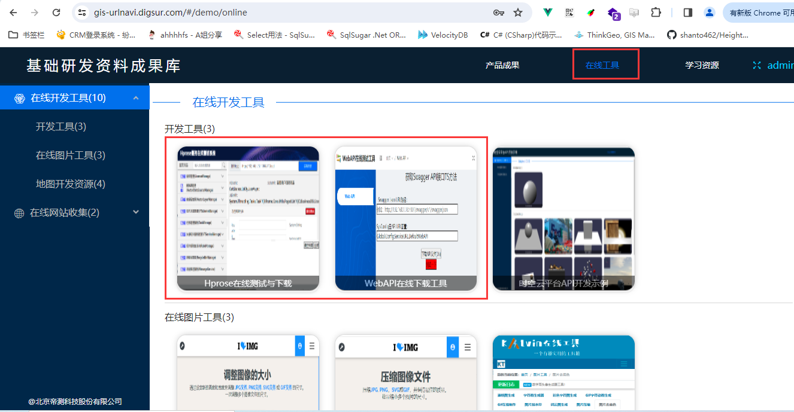

1. https://gis-hprosetest.digsur.com/   在线生成Hprose服务代码，放在<u>**/src/service**</u>文件夹下

   https://hprosetest.gis.digsur.com/#/home


2. https://gis-apitest.digsur.com/#/home   在线生成WebAPI服务代码，放在<u>**/src/api**</u>文件夹下

   https://apitest.gis.digsur.com/#/home


### store使用


### 用户登录

#### 1.接入统一用户权限管理系统

配置用户登录验证URL:**SysConfig.js里ServiceURL项的 <u>LoginAuthURL</u> 属性**


#### 2.用户登录密码加密方式

前端使用“XXTEA非对称加密”算法进行加密的。

#### 3. 外部后台使用用户系统，验证token

https://auth.gis.digsur.com/swagger/index.html 的 /api/Token/check方法，如果验证正确token，返回用户信息；如果错误，则报500异常

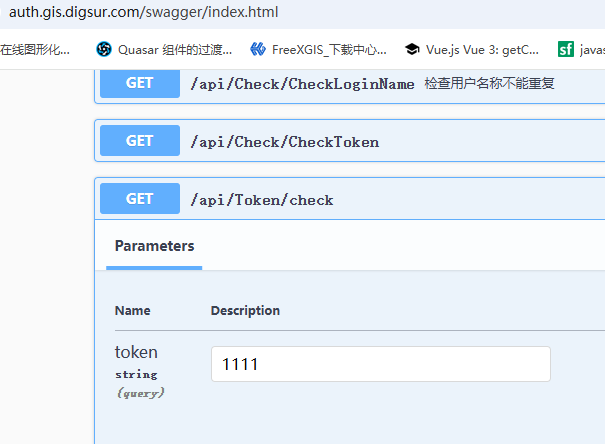

### Table表格规范化开发

> 参考模版代码为：src/pages/back/StandardTable/index.vue

下图为表格规范化结构：


- index.vue为表格所在主页面视图

- models/TabColummns.ts 为表格相关属性字段定义

- models/ActionMenus.ts 为表格行操作功能和扩展功能定义

- modals为表格相关弹框对话框内容，存放不同对话框文件夹

 涉及的主要组件为:

```typescript
import ActionMenu from "@/components/Menu/ActionMenu.vue";
import BaseContent from "src/components/Quasar/BaseContent.vue";
import PaginationLine from "@/components/Quasar/TableParts/PaginationLine.vue";
import TopFunBar from "@/components/Quasar/TableParts/TopFunBar.vue";
```

BaseContent ：为通用视图容器

TopFunBar：为顶部表格操作按钮栏

```vue
      <template #top="table">
        <TopFunBar :target="table" :batch="selected.length===0" :title="'服务列表'" @topBarClick="topBarClick" >
        </TopFunBar>
      </template>
```

PaginationLine：为分页切换栏

```vue
      <template v-slot:bottom>
        <div class="full-width row  justify-end">
          <PaginationLine :rows-number="rowSum" :rows-per-page="pagination.rowsPerPage" :max="pagesNumber">
          </PaginationLine>
        </div>
      </template>
    </q-table>
```

ActionMenu ：表格右侧操作按钮

```vue
      <template #body-cell-opt="props">
        <q-td :props="props" :auto-width="true">
          <ActionMenu :currentRow="props.row" @doActionClick="doActionClick"
            :default-menus="getRightDefaultMenus(props.row)" :append-menus="getRightMoreMenus(props.row)" />
        </q-td>
      </template>
```

TabColumns使用：

```typescript
import { columns, visibleColumns } from './models/TabColumns';
```

```vue
    <q-table class="fit sticky-header-table" selection="multiple" v-model:selected="selected" :dense="$q.screen.lt.md"
      separator="cell" flat bordered :rows="rows" :filter="filter" :columns="columns" row-key="name"
      :visible-columns="visibleColumns" v-model:pagination="pagination">
```

ActionMenus 使用

```typescript
import { getDefaultMenus, getMoreMenus } from "./models/ActionMenus";

//#region 更多操作
//获取表格的菜单栏
function getRightDefaultMenus(rowItem) {
  const menusArray = [...getDefaultMenus()];
  return menusArray;
}
function getRightMoreMenus(rowItem) {
  return getMoreMenus();
}
const doActionClick = (action, row) => {
  Global.Logger().trace('表格菜单点击', action, row);
  switch (action) {
    case "preview"://预览
      break;
    case "edit"://编辑
      edit(row);
      break;
    case "delete"://删除
      DBService.deleteItem(row.id).then(p => {
        query();
        Global.Message.info('删除成功')
      });
      break;
    // case "preview":
    //   preview(row);
    //   break;
  }
};
//#endregion
```

**index.vue完整表格页开发示例代码：**

```
<template>
  <base-content class="q-pa-sm" :style="sizeStyle">
    <q-table class="fit sticky-header-table" selection="multiple" v-model:selected="selected" :dense="$q.screen.lt.md"
      separator="cell" flat bordered :rows="rows" :filter="filter" :columns="columns" row-key="name"
      :visible-columns="visibleColumns" v-model:pagination="pagination">
      <template #top="table">
        <TopFunBar :target="table" :batch="selected.length===0" :title="'服务列表'" @topBarClick="topBarClick" >
          <template #rightAppend>
            <q-btn-dropdown outlined label="自选列" icon="view_list" no-wrap v-show="$q.screen.gt.sm">
              <q-list>
                <q-item tag="label" v-for="item in columns" :key="item.name">
                  <q-item-section avatar>
                    <q-checkbox v-model="visibleColumns" :val="item.name" />
                  </q-item-section>
                  <q-item-section>
                    <q-item-label>{{ item.label }}</q-item-label>
                  </q-item-section>
                </q-item>
              </q-list>
            </q-btn-dropdown>
          </template>
        </TopFunBar>
      </template>
      <template #body-cell-picture="props">
        <q-td :props="props">
          
          <span v-else>暂无</span>
        </q-td>
      </template>
      <template #body-cell-profile="props">
        <q-td :props="props">
          <q-btn v-if="props.row.pid" label="下载档案" color="primary" @click="doDowload(props.row.pid)" />
          <span v-else>暂无</span>
        </q-td>
      </template>

      <template #body-cell-opt="props">
        <q-td :props="props" :auto-width="true">
          <ActionMenu :currentRow="props.row" @doActionClick="doActionClick"
            :default-menus="getRightDefaultMenus(props.row)" :append-menus="getRightMoreMenus(props.row)" />
        </q-td>
      </template>
      <template v-slot:bottom>
        <div class="full-width row  justify-end">
          <!-- <q-pagination v-model="currentPage" :max="pagesNumber" /> -->
          <PaginationLine :rows-number="rowSum" :rows-per-page="pagination.rowsPerPage" :max="pagesNumber">
          </PaginationLine>
        </div>
      </template>
    </q-table>
  </base-content>
</template>

<script lang="ts" setup>
import ActionMenu from "@/components/Menu/ActionMenu.vue";
import BaseContent from "src/components/Quasar/BaseContent.vue";
import { appStore } from 'src/stores';
import { computed, onMounted, onUnmounted, ref, watch } from "vue";
import DBService from "@/database/CommonDB/DBService";
import { OffEventHandler, OnEventHandler } from '@/events';
import TableEvent from '@/events/modules/TableEvent';
import { doLoadModal } from '@/utils/WidgetsTool';
import { Global, SaveAs } from "xframelib";
import { getDefaultMenus, getMoreMenus } from "./models/ActionMenus";
import { columns, visibleColumns } from './models/TabColumns';
import PaginationLine from "@/components/Quasar/TableParts/PaginationLine.vue";
import TopFunBar from "@/components/Quasar/TableParts/TopFunBar.vue";

defineOptions({ name: "StandardTable" })
const appState = appStore();
const sizeStyle = computed(() => {
  return appState.showTabMenu ? "padding-bottom: 30px;" : "";
})
const pagination = ref({
  sortBy: 'id',
  descending: false,
  page: 1,
  rowsPerPage: 10
})
const currentPage = ref(1);
//总记录数
const rowSum = ref(0);
const pagesNumber = computed(() => {
  return Math.ceil(rowSum.value / pagination.value.rowsPerPage)
})
const filter = ref<string>("")
const selected = ref([]);
const keywordRef=ref('');

//页码发生变化
watch(() => currentPage.value, val => {
  query();
})

//#region 通用对话框的相关代码
function showModal(actionMethod: string, rowData?: any) {
  let modalID: string = '';
  let extraData: any;
  switch (actionMethod) {
    case 'add':
      modalID = 'addEditForm';
      extraData = {
        title: `新建`,
        footer: 'true'
      };
      break;
    case 'edit':
      modalID = 'addEditForm';
      extraData = {
        title: `编辑`,
        footer: 'true'
      };
      break;
  }
  if (modalID) {
    const modalData = {
      modalID,
      extraData,
      rowData,
      width: 700
    };
    doLoadModal(modalData);
  }
}
//#endregion
//#region 更多操作
//获取表格的菜单栏
function getRightDefaultMenus(rowItem) {
  const menusArray = [...getDefaultMenus()];
  return menusArray;
}
function getRightMoreMenus(rowItem) {
  return getMoreMenus();
}
const doActionClick = (action, row) => {
  Global.Logger().trace('表格菜单点击', action, row);
  switch (action) {
    case "preview"://预览
      break;
    case "edit"://编辑
      edit(row);
      break;
    case "delete"://删除
      DBService.deleteItem(row.id).then(p => {
        query();
        Global.Message.info('删除成功')
      });
      break;
    // case "preview":
    //   preview(row);
    //   break;
  }
};
//#endregion

/**
 * 表格上方菜单操作
 */
const topBarClick = (val: string, searchValue: string) => {
  switch (val) {
    case 'searchWord':
      keywordRef.value=searchValue;
      query();
      break;
    case 'creatNew':
      add();
      break;
    case 'batchDelete':
      batchDelete();
      break;
    case 'refresh':
      query();
      break;
  }
};

const rows = ref<any>([])
async function query(data:{page?:number,pageSize?:number} = undefined) {
  if (data) {
    if (data.page)
    {
      currentPage.value = data.page;
    }

    if (data.pageSize) {
      pagination.value.rowsPerPage = data.pageSize;
    }
  }
    //获取总记录数
    rowSum.value=await DBService.getCount();
    if(currentPage.value>pagesNumber.value)
       currentPage.value = pagesNumber.value;
  //请求用户数据
  DBService.getPageList(keywordRef.value, currentPage.value, pagination.value.rowsPerPage).then(data => {
    rows.value = data;
  });
}
//批量删除
 function batchDelete()
{
  if(selected.value.length>0)
  {
     DBService.batchDelete(selected.value).then(()=>query());
  }
}
//添加新记录
function add() {
  showModal('add', { name: '', age: 10 });
}
function edit(item) {
  showModal('edit', item);
}
//下载
async function doDowload(pid: number) {
  const pp = await DBService.getProfile(pid);
  if (pp) {

    SaveAs(pp.file, pp.name);
  }
}
onMounted(() => {
  OnEventHandler(TableEvent.RefeshTable, query);
  //初始化
  query();
})
onUnmounted(() => {
  OffEventHandler(TableEvent.RefeshTable, query);
})
</script>
<style lang="scss" scoped></style>
```


### 系统Logger替换Console.log

> SysConfig.js里UI的ProductLog 来控制：发布后系统是否输出系统日志
>
> 发布后建议改为：false

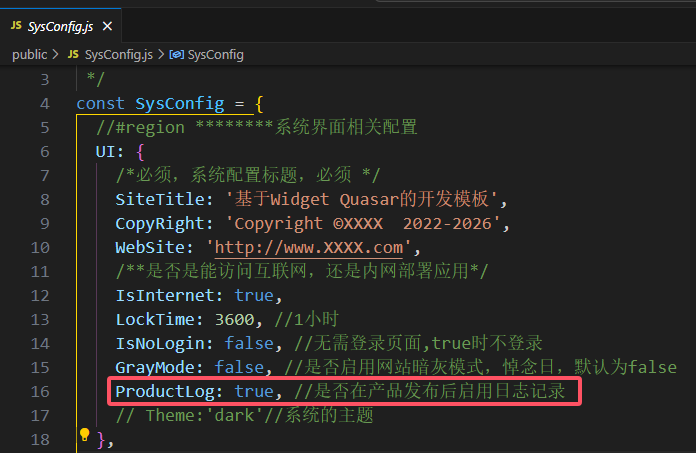

####**Logging使用方法：**

==**Global.Logger().info** 代替 **Console.log**==

5 actual logging methods, ordered and available as:

- `Global.Logger().trace(msg)`
- `Global.Logger().debug(msg)`
- `Global.Logger().info(msg)`
- `Global.Logger().warn(msg)`
- `Global.Logger().error(msg)`

 `log.setLevel(level, [persist])`

This disables all logging below the given level, so that after a `log.setLevel("warn")` call `log.warn("something")` or `log.error("something")` will output messages, but `log.info("something")` will not.

####**本质原理：**

xframelib使用封装了loglevel库，https://www.npmjs.com/package/loglevel

```
  //日志记录
  Logger: (name?: string) => {
    //标记是否第一次判断
    if (!firstLogger) {
      //开发环节和产品发布后
      if (import.meta.env?.DEV || SysConfig.UI.ProductLog) {
        Log.enableAll();
      } else {
        //Log.disableAll();//trace  0
        Log.setDefaultLevel("warn"); //3
      }
      firstLogger = true;
    }
    const logname = name || "default";
    return Log.getLogger(logname);
  }
```


### settings配置

#### 1. projectSetting.ts 系统配置

实现接口ProjectConfig：

```
export interface ProjectConfig {
  //左侧抽屉-菜单状态
  leftDrawerOpen:boolean;
   //刷新页面
   reloadFlag:boolean;
   //显示TabMenu
   showTabMenu:boolean;
   TabMenuHeight:number;
   //显示breadcrumbs
  showBreadCrumbs:boolean;
  //#region 新增的，根据业务需要进行增加
  //整体默认主题样式
  themeStyle: string;
  //暗黑样式
  darkTheme: string;
  //是否收缩，默认收缩(左侧)
  leftCollapsed: boolean;
  //是否浮动起来(左侧菜单)
  overlayMenu: boolean;
  // 针对后台类布局的设置
  //右侧-主内容高度
  layoutContentHeight: number;
  //右侧-主内容宽度
  layoutContentWidth: number;
  //#endregion

  //#region  未启用配置字段（备用）
  // 是否显示SettingButton
  showSettingButton: boolean;
  // pageLayout whether to enable keep-alive
  openKeepAlive: boolean;
  // Use error-handler-plugin
  useErrorHandle: boolean;
  //#endregion

  // Whether to display the logo
  showLogo: boolean;
  // Whether to show the global footer
  showFooter: boolean;
  //底部栏的高度
  footerHeight: number;
  // menuType: MenuTypeEnum;
  headerSetting: HeaderSetting;
  // menuSetting
  menuSetting: MenuSetting;
}
```

leftDrawerOpen 控制左侧抽屉_菜单状态（展开/收缩）

   //显示TabMenu

 showTabMenu:true,

 TabMenuHeight:30,

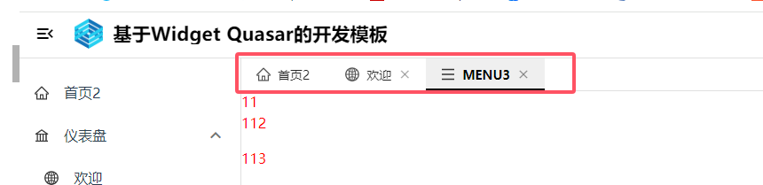

 //显示面包屑

 showBreadCrumbs:true,


#### 2. widgetSettings配置

#####  2.1 配置规则


##### 2.2 配置布局白名单

**src/permission/index.ts**

配置或修改对应的**免登录**可看的layout名称，**<u>否则无法获取到对应的widgetConfig列表</u>**。例如：

 **const layoutIDwhiteList = ['portalLayout', 'bigScreenLayout', 'productLayout'];**

```typescript
/**
 * 白名单数组
 */
const resultWhiteList: Array<IWidgetConfig> = [];
/**
 * 获取不需要登录时，白名单
 * Layouts对应的WidgetConfig数组
 * @returns
 */
function getWhiteListWidgetConfig() {
  const layoutIDwhiteList = ['portalLayout', 'bigScreenLayout', 'productLayout'];
  if (resultWhiteList.length === 0)
    widgetConfigSetting.forEach((it) => {
      const layoutid = it.layoutID;
      if (layoutid) {
        const idx = layoutIDwhiteList.indexOf(layoutid);
        if (idx >= 0) resultWhiteList.push(it);
      }
    });
  return resultWhiteList;
}
```

#### 3.modalSetting配置

> modalSetting是用来配置动态对话框内容组件的配置，一般按布局或视图分文件配置


##### 弹框使用方法

1. 为Layout布局，配置弹框容器ModalContainerWidget.vue，并默认加载 

   弹框容器路径：**<u>src/widgets/layouts/ModalContainerWidget.vue</u>**

   ```
     {
       layoutID: 'backLayout', //归属组
       id: 'ModalContainerWidget',
       label: '弹框容器',
       container: LayoutContainerEnum.top,
       component: () => import('src/widgets/layouts/ModalContainerWidget.vue'),
       preload: true
     },
   
   ```

   

2. 编写对话框内容组件

   以对话框src/pages/back/standardTable/modals/addEditForm.vue为例

   1）**定义对话框名称标识，要与modalSetting里配置相同**

   ```
   const name = 'addEditForm';
   defineOptions({ name: 'addEditForm' });
   ```

   2）固定内容，**用于确认或取消的处理方法**

   ```
   import { ref, onMounted, onUnmounted, watch } from 'vue';
   import { OffEventHandler, OnEventHandler, EmitMsg } from '@/events';
   import { IExtraProperty } from '@/models/IModalModels';
   
   //#region 固定模板
   //确定或取消的处理方法
   function OkCancelHandler(isOk: boolean) {
     if (isOk) {
       onSubmit();
     } else {
       formRef.value = {}
     }
   }
   onMounted(() => {
     //启动时监听
     OnEventHandler(name, OkCancelHandler);
     // init(props.data);
   });
   onUnmounted(() => {
     OffEventHandler(name, OkCancelHandler);
   });
   //#endregion 
   ```

   3）**定义props**，固定两个props属性名为**data**和**extra**,类型可自定义或默认为object。用于接收弹框打开时，从外面传入的相关参数。

   ```
   import { object, oneOfType } from 'vue-types';
   import { IExtraProperty } from '@/models/IModalModels';
   
   const props = defineProps({
     data: oneOfType([Object]).def({}),
     extra: object<IExtraProperty>().isRequired,
   });
   ```

   props.data是外部传入的主要数据，主要用于填充表格，使用示例如下：

   ```
   const formRef = ref({});
   watch(
     () => props.data,
     val => {
       //initData();
       if (val)
         formRef.value = { ...val }
       else
         formRef.value = {}
     }, { immediate: true, deep: true }
   );
   ```
在template模版里绑定相关业务值 **formRef.name**
   ```
     <q-form class="modalContent column">
       <q-scroll-area class="col">
         <div class="row q-col-gutter-x-md dialog_form q-pa-md">
           <div class="col-6">
             <h5>
               <q-icon name="star" color="red" />姓名：
             </h5>
             <q-input outlined dense v-model="formRef.name" type="text" />
           </div>
           <div class="col-6">
             <h5>年龄：</h5>
             <q-input outlined dense v-model="formRef.age" type="text" />
           </div>
           <div class="col-12">
             <h5>上传简历</h5>
             <q-btn no-wrap v-show="$q.screen.gt.sm" label="上传" icon="mdi-cloud-upload-outline" color="primary"
               @click="doUpload">
               <q-uploader ref="profileUploader" :max-files="1" class="hidden" accept=".doc, .docx, .pdf" field-name="file"
                 @added="fileUpload" />
             </q-btn>
           </div>
         </div>
       </q-scroll-area>
     </q-form>
   ```

3. 调用对话框

调用showModal方法，传入actionMethod方法名和数据，例如：

```
//添加新记录
function add() {
  showModal('add', { name: '', age: 10 });
}
//编辑
function edit(item) {
  showModal('edit', item);
}
```

showModal方法模版：

```
//#region 通用对话框的相关代码
function showModal(actionMethod: string, rowData?: any) {
  let modalID: string = '';
  let extraData: any;
  switch (actionMethod) {
    case 'add':
      modalID = 'addEditForm';
      extraData = {
        title: `新建`,
        footer: 'true'
      };
      break;
    case 'edit':
      modalID = 'addEditForm';
      extraData = {
        title: `编辑`,
        footer: 'true'
      };
      break;
  }
  if (modalID) {
    const modalData = {
      modalID,
      extraData,
      rowData,
      width: 700
    };
    doLoadModal(modalData);
  }
}
//#endregion
```

### 环境变量设置与使用

> VUE自带环境变量与 .env里用户自定义环境变量
>
> process.env.*

  **console.log('环境变量',process.env);**
  结果如下：


#### 1. VUE自带环境变量

process.env.App_URL 网站根地址

process.env.DEV 开发模式

process.env.PROD 开发模式

#### 2. .env用户自定义环境变量

用户自定义环境变量，必须是：“VITE_ ”开头，且全部大写，保存在 .env文件里。

自定义环境变量：process.env.VITE_PROJ_NAME

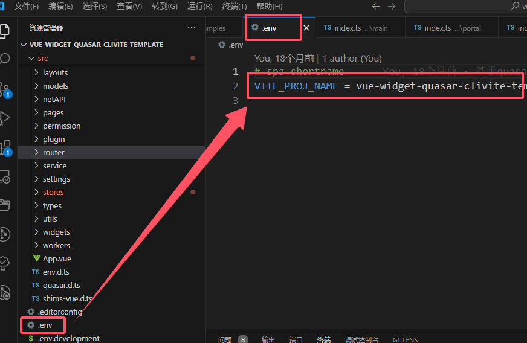

#### 3.环境变量使用（全局绑定）

全局绑定方式：

```vue
  //保存网站根地址
  app.config.globalProperties.$AppURL=process.env.APP_URL;
```

使用/调用方式

```typescript
console.log(this.$AppURL);
```


### 锁屏功能

> 前端开发模板默认支持锁屏功能，锁屏后将清除本地用户token，需要重新登录，默认锁屏时间为1小时

* 通过SysConfig.UI.LockTime来设置锁屏时间，以秒为单位，不小于10秒。

* 锁屏监听onLockListener,本质是document监听 mousedown、mousemove事件

  ```ts
  /**
   * 全局监听Lock
   */
  export function onLockListener() {
    //开始监听
    // console.log('开始监听 mousedown');
    timekeeping();
    document.addEventListener('mousedown', timekeeping);
    document.addEventListener('mousemove', timekeeping);
  }
  ```

* 取消锁屏监听 unlockListener

  ```ts
  /**
   * 取消全局监听Lock
   */
  export function unLockListener() {
    // console.log('注销监听 mousedown');
    document.removeEventListener('mousedown', timekeeping);
    document.removeEventListener('mousemove', timekeeping);
  }
  ```

* 锁屏状态，以reactive对象，通过watch监视LockState.isLock状态，确定进入锁屏状态

  ```ts
      watch(()=>LockState.isLock,value=>{
        Global.Logger().debug('监听锁屏状态变化',value);
      })
  ```

  

### 主题设置

> Quasar默认支持的黑/白模式主题；自定义扩展其他主题

#### 1.Quasar默认的黑/白主题模式

主题存放路径：**<u>src/css/theme.css</u>** 

**1）黑白主题模式全局变量定义:**

**.body--light为浅色模式的通用变量定义；.body--dark为深色模式的通用变量定义。**


**2）单个组件的（局部）黑白主题模式样式定义:**

在 style里，将样式定义，分别包在 .body--light和.body--dark里

```css
<style lang="scss" scoped>
.body--light {
  .header {
    color: black;
    background-color: white;
  }
}

.body--dark {
  .header {
    color: white;
    background-color: $dark;
  }
}
</style>
```


#### 2.自定义扩展其他主题

存放路径在：public/theme/*.css定义不同主题的相关变量

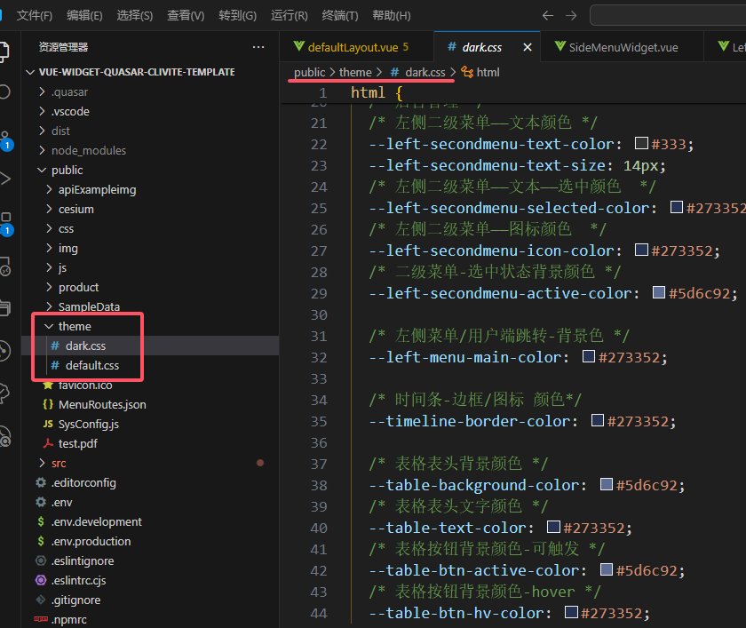

需要修改SysConfig.js进行开启和切换主题样式


#### 3. 定义SCSS样式变量

路径：src/css/quasar.variables.scss，定义css变量，以$开头

Quasar SCSS (& Sass) Variables

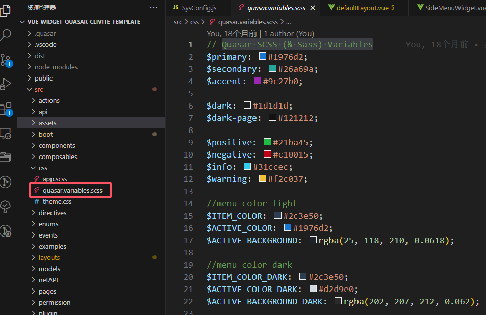

使用方式：$ITEM_COLOR

```
<style lang="scss" scoped>
.body--light {
  .base-menu-item {
    color: $ITEM_COLOR !important;

    .baseRootItemActive {
      color: $ACTIVE_COLOR !important;
    }

    .baseItemActive {
      color: $ACTIVE_COLOR !important;
      background: $ACTIVE_BACKGROUND;
      transition: all 0.618s;
      font-weight: bold;

      &:after {
        content: '';
        position: absolute;
        width: 3px;
        height: 100%;
        background: $ACTIVE_COLOR !important;
        top: 0;
        right: 0;
      }
    }
  }
}

.body--dark {
  .base-menu-item {
    color: $ITEM_COLOR_DARK !important;

    .baseRootItemActive {
      color: $ACTIVE_COLOR_DARK !important;
    }

    .baseItemActive {
      color: $ACTIVE_COLOR_DARK !important;
      background: $ACTIVE_BACKGROUND_DARK;
      transition: all 0.618s;
      font-weight: bold;

      &:after {
        content: '';
        position: absolute;
        width: 3px;
        height: 100%;
        background: $ACTIVE_COLOR_DARK !important;
        top: 0;
        right: 0;
      }
    }
  }
}
</style>
```


###  其他问题

#### 1. quasar spa打包后index.html 双引号丢失问题

    原因：quasar 使用了html-minifier库  npmjs.com/package/html-minifier
    解决方法：
    **Ignoring chunks of markup**
    If you have chunks of markup you would like preserved, you can wrap them <!-- htmlmin:ignore -->.
    

#### 2. 打包后编译，运行预览

​     **<u>quasar serve  dist/spa</u>**

  - 全局安装 @quasar/cli
    
  -  预览命令  **quasar serve  dist/spa**

#### 3. 使用cesium注意事项：

  - 需要安装与配置 vite-plugin-cesium插件，build发布时，会在index.html自动添加js和css引入
    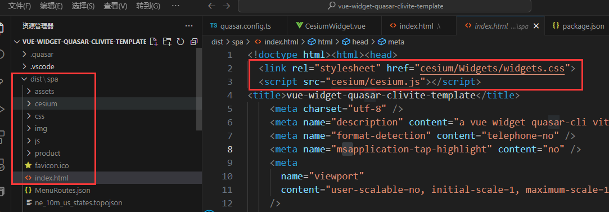
  - 在public/cesium目录下放在cesium发布版代码和资源，不能删减Assets
    
#### 4. cesium升级的注意事项

   package.json里的cesium版本升级，同时需要拷贝 **nodemodules/cesium/Build/Cesium**文件下全部内容，替换项目**public/Cesium**文件下内容。

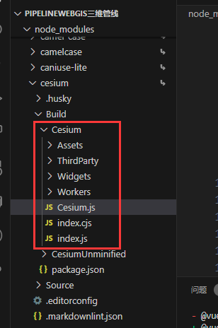

#### 5. 项目打包报“Top-Level-Await”错误

> 修改quasar.config.ts文件，增加viteConf.esbuild项内容为：
>
>      supported: {
>       'top-level-await': true
>      },


​    解决方法截图：


#### 6. quasar默认的material图标查询

查询地址：https://mui.com/material-ui/material-icons/

Iconfify图标库地址：https://icon.gis.digsur.com/     的material-symbols图标库，**图标名要以<u>下划线</u>连接**。


#### 7. 定义路径别名

参考：https://quasar.dev/quasar-cli-vite/handling-vite#folder-aliases

```
{
  "extends": "@quasar/app-vite/tsconfig-preset",
  "compilerOptions": {
    "baseUrl": ".",
    "paths": {
      "src/*": ["src/*"],
      "app/*": ["*"],
      "components/*": ["src/components/*"],
      "layouts/*": ["src/layouts/*"],
      "pages/*": ["src/pages/*"],
      "assets/*": ["src/assets/*"],
      "boot/*": ["src/boot/*"],
      "stores/*": ["src/stores/*"],

      "utils/*": ["src/utils/*"]
    }
  }
}
```

https://www.npmjs.com/package/vite-tsconfig-paths

统一在tsconfig.json里**paths项**定义**路径别名**，通过在**quasar.config.ts** 增加vite插件**<u>vite-tsconfig-paths</u>**来启用。

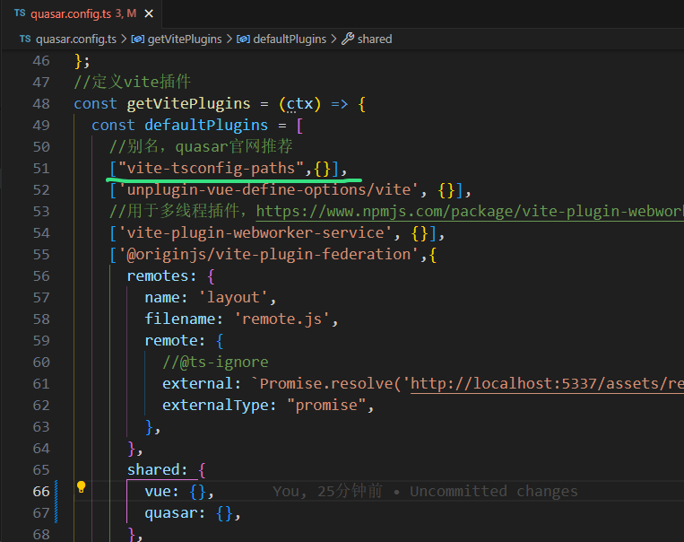

#### 8. 解决import路径警告问题

问题如下：

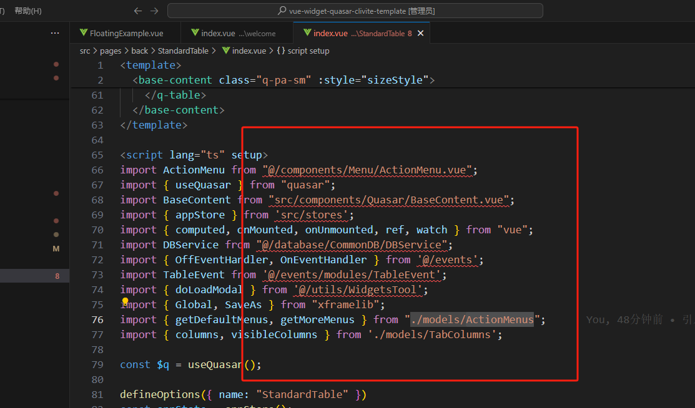

解决方法：在tsconfig.json 添加上"include": ["src/**/*"]

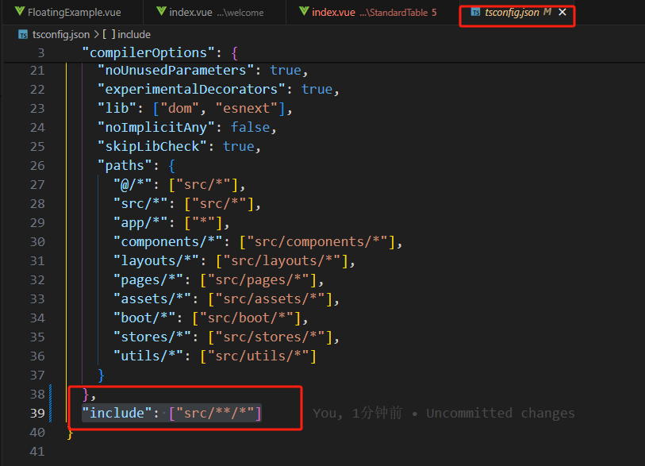

参考：https://juejin.cn/post/6924264635218542605  

https://segmentfault.com/q/1010000040178399

#### 9.解决二级目录部署网站时相关资源请求路径不对问题

解决方法：

1）quasar.config.ts配置 启用 **publicPath : './'**

2）图片等资源路线去掉“/” 例如：

**SampleData/README.md**

```ts
function doTextDownlaod()
{
    get('SampleData/README.md').then(p=>{
        if(p.data)
        SaveAs(p.data,'test.md');
    })
}
```

**img/logo.png**

```vue
        <div id="logo-part">
          
          
        </div>
```

 **icon: 'apiExampleimg/basicLayerManager.png'**


###  WebWorker提升性能：vite-plugin-webworker-service插件

> 说明：使用vite-plugin-webworker-service来代替workerpool库。**因为 workerpool库有局限性，无法使用import引入外部类库或方法。**

[vite-plugin-webworker-service - npm (npmjs.com)](https://www.npmjs.com/package/vite-plugin-webworker-service)

**Vite plugin webworker service** is a lightweight, powerful, and easy-to-use tool designed to make working with WebWorkers in your projects as seamless as possible.

**The plugin generates a webworker file based on the used files ending in .service, as well as a bridge between the main thread and the webworker thread at build time**, thereby allowing you to enjoy the reliability of typescript typechecks and various code editor tools, which cannot be achieved by directly using webworkers with postMessage and onmessage

Quasar.config配置：
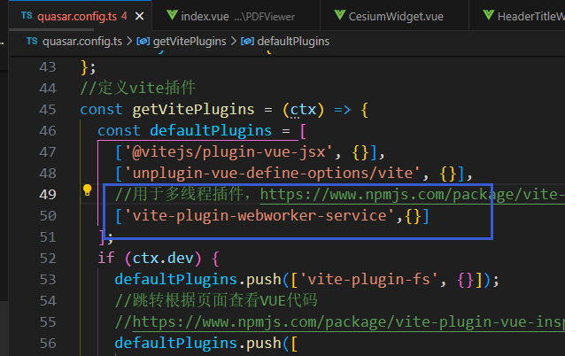

使用在 src/workers目录下编写 **.service.ts文件，自动编译成module模块化的worker.js


### Animate.css使用方法
> Animate.css is a library of ready-to-use, cross-browser animations for use in your web projects. Great for emphasis, home pages, sliders, and attention-guiding hints.
> https://animate.style/
#### 1. 在CSS中使用
直接使用动画的原始名称，例如 “fadeIn” 
```typescript
<script setup lang="ts">
import { array, number, string } from 'vue-types';
import IFlashCardSection from './IFlashCardSection';
const props = defineProps({
  animateIn: string().def('fadeIn'),
  dataList: array<IFlashCardSection>().def([]),//数据列表
  nwidth: number().def(340),//面板宽度
  nheight: number().def(238),//面板高度
})
</script>
```
在CSS里使用方法如下：**animation:fadeIn;**
```css
.flash_card {
  position: relative;
  width: v-bind(nwidth);
  height: v-bind(nheight);
  text-align: center;
  display: inline-block;
  &:hover {
    .sectionHoverDiv {
      -webkit-animation: v-bind(animateIn) 2s;
      animation: v-bind(animateIn) 2s;
      visibility: visible;
    }
  }
}
```

#### 2. 在VUE组件中使用——TransitionSlide.vue
参考：https://vuejs.org/guide/built-ins/transition.html#custom-transition-classes
https://www.quasar-cn.cn/options/animations

- 多个元素的动画
也可以为一组 DOM/组件添加过渡动画。

``` vue
<!-- 多个元素/组件的示例 -->
<transition-group
  appear
  enter-active-class="animated fadeIn"
  leave-active-class="animated fadeOut"
>

  <p key="text">
     Lorem Ipsum
  </p>
  <q-btn
    key="email-button"
    color="secondary"
    icon="mail"
    label="Email"
  />
</transition-group>
```
在上面的多元素示例中注意:

注意使用 <transition-group> 代替了 <transition>.
DOM/组件都有 key 属性标记，例如key="text" 或者 key="email-button"
上面的两个示例中都使用了appear属性，这使得动画在组件渲染后将立即执行一次。此属性是可选的。


- 组件位置：src/components/TransitionSlide.vue
```
<template>
  <Transition
    mode="out-in"
    name="animate__slide"
    :duration="duration"
    :appear="appear"
    :enter-active-class="`animated ${enter}`"
    :leave-active-class="`animated ${leave}`"
  >
    <slot></slot>
  </Transition>
</template>
<script lang="ts">
import { defineComponent } from 'vue';
export default defineComponent({
  name: 'TransitionSlide',

  props: {
    enter: {
      type: String,
      default: 'fadeIn'
    },
    leave: {
      type: String,
      default: 'fadeOut'
    },
    duration: {
      type: Number,
      default: 1000
    },
    appear: {
      type: Boolean,
      default: true
    }
  }
});
</script>
```


#### 3.使用v-wow中使用方法

```
<template>
  <div :style="{ overflow: 'auto', height: containerHeight + 'px' }">
    <VideoPanel v-wow="{ 'animation-name': 'slideInDown' }"></VideoPanel>
    <div v-wow="{ 'animation-name': 'slideInUp' }" style="background-color: #f00; height: 400px; width: 100%"></div>
    <div v-wow="{ 'animation-name': 'slideInLeft' }" style="background-color: #0f0; height: 400px; width: 100%"></div>
    <div v-wow="{ 'animation-name': 'slideInUp' }" style="background-color: #00f; height: 400px; width: 100%"></div>
    <CarouselPanel v-wow="{ 'animation-name': 'slideInLeft', 'animation-duration': '2s' }"></CarouselPanel>
    <VideoPanel v-wow="{ 'animation-name': 'slideInRight', 'animation-duration': '2s' }"></VideoPanel>
  </div>
</template>

<script setup lang="ts">
import { computed } from 'vue';

import CarouselPanel from '../ScrollPage/CarouselPanel.vue';
import VideoPanel from '../ScrollPage/VideoPanel.vue';
const containerHeight = computed(() => {
  return document.body.clientHeight; //LayoutTool.getContentHeight();
});
</script>
```
#### 4. 在Quasar中使用
Built-in animation classes
https://quasar.dev/options/animations#introduction

https://www.quasar-cn.cn/options/transitions/
Quasar 组件的过渡效果
一些 Quasar 组件可以通过transition-show/transition-hide 或 transition-prev/transition-next 或 transition 等属性来控制过渡效果:

**1）transition-show/transition-hide**

QBtnDropdown
QInnerLoading
QTooltip
QMenu
QDialog
QSelect (通过 QMenu 和 QDialog)
QPopupProxy (通过 QMenu 和 QDialog)

```vue
<q-menu
  transition-show="jump-down"
  transition-hide="jump-up"
/>
```

**2）transition-prev/transition-next**

QCarousel
QTabPanels
QStepper
transition

**3）QIntersection**
> <q-intersection once transition="scale">
```vue
      <q-intersection once transition="flip-right">
      <FlashCardPanel :data-list="dataDemoList"></FlashCardPanel>
      </q-intersection>
```


## Iconify图标在线服务+离线图标

[23年了，icon 方案该升级了 - 掘金 (juejin.cn)](https://juejin.cn/post/7189164727485300793)

，[iconify](https://link.juejin.cn?target=https%3A%2F%2Fgithub.com%2Ficonify%2Ficonify) 的方案充分利用 svg 能力，利用 `iconify.json` 存储图标矢量信息。再通过下游的不同消费方式，开发者可以制作任意自己喜欢的图标消费方式。利用开放的形态，成功的将生产端和消费端以一种非依赖的关系分开，使用者可以自由组合。在经过一些年的发展，又拥有海量的存量图标和丰富的生态。

在项目中，利用上述方案，我们在不改变设计师习惯的同时，保留了开发者熟悉工具，还创新的引入了更好的图标方案。

[iconify](https://link.juejin.cn?target=https%3A%2F%2Fgithub.com%2Ficonify%2Ficonify) 方案中，我们可以避免上述提到的"字体"所带来的一切弊端，同时具备了以下几项优势：

- **按需引入**，按照项目使用的图标打包产物，无惧新增
- **自由组合**，随便你需要使用什么图标，来自哪个包、哪个业务的图标，统统都是 SVG
- **文字样式**，所有图标产物具备文字样式控制，无对齐问题，可以直接通过样式控制其颜色、大小等
- **多端**，不论 PC、Mobile，不论你用什么组件库，开箱即用（只需容器支持 SVG）
- **可复制**，如果你不满意，或者设计师觉得不符合当前的业务，完全可以利用同样的方案，轻松制作另外一个 SVG 包（不超过 1 分钟）

​	作者：YeeWang
​	链接：https://juejin.cn/post/7189164727485300793

###  **Iconify图标在线服务使用 **

1.  **为VSCode安装Iconify IntelliSense插件**


2.  **前端工程中安装开发依赖 npm i -D @Iconify/vue**


3. **vue页面/组件开发中使用Iconify图标（默认为在线模式）**
- 1) 引用@Iconify/vue;

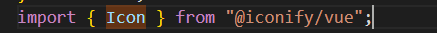

- 2) 直接使用<Icon/>，默认使用官方的图标服务

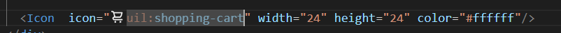


- 3) 如要使用自己图标在线服务地址，需在SysConfig.js里配置。

注意：服务地址最后不能带“/”

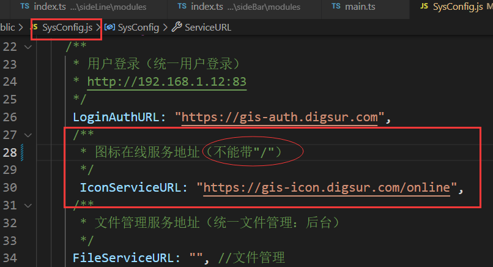


### Iconify图标在线服务列表

提供符合Iconify标准服务接口的 在线SVG图标服务

1.  **国外服务地址**

- 默认官方[https://icon-sets.iconify.design/](https://icon-sets.iconify.design/)<br>
 后台服务：[https://api.iconify.design/](https://api.iconify.design/)

- [https://icon-sets.iconify.design/](https://icon-sets.iconify.design/)<br>
 后台服务：[https://icones.js.org/collections/](https://icones.js.org/collections/)

2.  **国内服务地址**

- [https://gis-icon.digsur.com](https://gis-icon.digsur.com)<br>
后台服务：[https://gis-icon.digsur.com/online](https://gis-icon.digsur.com/online)

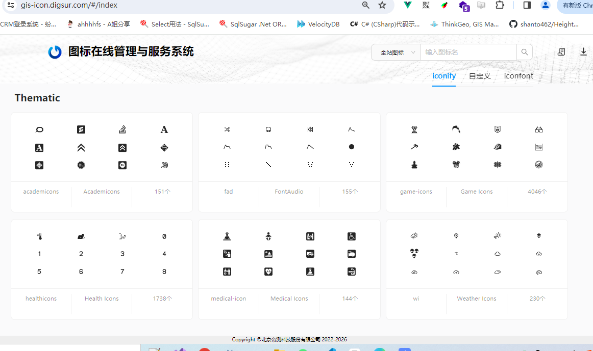

###  离线Icon图标使用说明
>使用情景：不部署icon图标服务或内网环境下

 <u>**离线操作步骤：**</u>
	**如果项目部署是需要使用离线图标方式，在项目开发结束后，打包前进行如下设置和操作。**

1.  下载**IconOffline.exe命令行工具**，放在前端工程src同目录下，指定图标在线服务地址URL，运行扫描前端工程源码，生成图标离线注册文件。

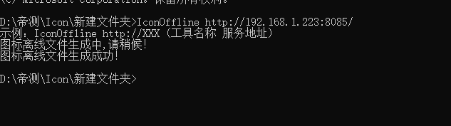

2. 成功后会在src下的components中见到生成的IconOffline.ts文件（有新增代码，重新生成离线图标文件）


3.  将SysyConfig.js中的 **IconServiceURL置空**，重新启动工程或网站，即可切换到使用**离线图标状态**下。


## VSCode 用户代码片段

### CodeSnippets在线生成工具

[https://snippet-generator.app/](https://snippet-generator.app/)


---

###  积累的代码片段代码

- 代码片段存储位置

  C:\Users\用户名\AppData\Roaming\Code\User\snippets

- 代码片段集合     [下载](./data/snippets20231219.zip)


## 前端升级支持扫码登录方法

使用“帝测授权宝”APP -android版，实现前端系统的扫码登录。扫码APP是默认连接外网用户权限管理系统，也就是系统SysConfig.js的LoginAuthURL为：https://gis-auth.digsur.com

### 使用Antdesign版模版的升级

升级支持扫码登录需要修改内容：


- 增加@microsoft/signalr依赖库

  npm install @microsoft/signalr

- SysConfig.js中APIPath，增加 SignalR:'chathub'

  

- 修改或更新public/css/common.css

  补充下面样式：

  ```
  .righttop-login
  {
    position: absolute;
    right: 0;
    top:0;
    width:50px;
    height:50px;
  }
  .loginQRCode
  {
    margin:0 auto;
    width:250px;
    height:200px;
    display: flex;
    justify-content: center;
    align-items: center;
    font-size: 16px;
  }
  .login-top-append
  {
    font-size: 14px;  
    color:gray;
    text-align: center;
    margin-top: -10px;
    margin-bottom: 10px;
  }
  ```

  

- 下载替换views/shared/login/index.vue文件

  [旧版本的login-index.vue](./data/旧版本login-index.vue "index.vue")

- 补充与替换登录相关图片

  
  
  [扫码图标.zip下载](./data/扫码图标.zip)

### 使用Quasar版模版的升级

- 修改或更新public/css/common.css

  补充下面样式：

  ```
  .righttop-login
  {
    position: absolute;
    right: 0;
    top:0;
    width:50px;
    height:50px;
  }
  .loginQRCode
  {
    margin:0 auto;
    width:250px;
    height:200px;
    display: flex;
    justify-content: center;
    align-items: center;
    font-size: 16px;
  }
  .login-top-append
  {
    font-size: 14px;  
    color:gray;
    text-align: center;
    margin-top: -10px;
    margin-bottom: 10px;
  }
  ```

  

- 下载替换pages/shared/login/index.vue文件

  [新login-index.vue](./data/新login-index.vue "index.vue")

- 补充与替换登录相关图片

  
  
  [扫码图标.zip下载](./data/扫码图标.zip)


## *重要业务组件使用

### 0. QLayoutMainContainer组件

> **解决LayoutContainer与QLayout等组件的兼容使用问题**
>
> 用于LayoutContainer的mainContainer容器的router-view页面切换；
>
> 以支持视图里使用 QPage、QFoot等组件（这些Quasar组件要求必须放在QLayout里）

- 使用范围 

  web /mobile app/ electron

- 安装依赖

  无

- 组件路径和方法

  src/components/Quasar/QLayoutMainContainer/index.vue

- 使用示例

  在Layouts里使用，例如：backLayout.vue的

  ```vue
    <template #main>
      <QLayoutMainContainer/>
    </template>
  ```

  import **QLayoutMainContainer** from 'src/components/Quasar/QLayoutMainContainer/index.vue';

  ```vue
  <template>
    <LayoutContainer
      :widgetConfig="configRef"
      :layoutID="layoutIDRef"
      @containerLoaded="loadedHandler"
    >
    <template #main>
      <QLayoutMainContainer/>
    </template>
    </LayoutContainer>
  </template>
  
  <script lang="ts" setup>
  import { storeToRefs } from 'pinia';
  import { getRightWidgetConfig } from 'src/permission';
  import { appStore,tabMenuStore } from 'src/stores';
  import {  onMounted, ref, watch } from 'vue';
  import { Global, H5Tool, LayoutContainer, LayoutManager } from 'xframelib';
  import QLayoutMainContainer from 'src/components/Quasar/QLayoutMainContainer/index.vue';
  ……
  </script>
  ```

  

###    1. PDFViewer组件

- 使用范围 

   web /mobile app/ electron

- 安装依赖

  npm install  @tato30/vue-pdf

- 组件路径和方法

  src/components/PDFViewer/index.vue

  src/components/PDFViewer/PDFTool.ts

- 示例

  ```vue
  <template>
    <div style="width:100%;height:500px;">
      <PDFViewer></PDFViewer>
    </div>
  
  </template>
  
  <script setup lang="ts">
  import PDFViewer from 'src/components/PDFViewer/index.vue';
  //任意位置改变PDF路径时引用
  import { setPDF } from 'src/components/PDFViewer/PDFTool';
  import {onMounted } from 'vue';
  
  onMounted(()=>{
    setPDF('/test.pdf');//任意位置进行调用setPDF
  })
  
  </script>
  
  <style scoped lang="scss"></style>
  
  ```

  

- 示例效果截图

  
  
  
  
- **ERROR: Top-level await**错误解决：
  
  如下错误
  
  ```
   [vite] error while updating dependencies:
  Error: Build failed with 1 error:
  node_modules/.pnpm/pdfjs-dist@4.2.67/node_modules/pdfjs-dist/build/pdf.mjs:19764:53: ERROR: Top-level await is not available in the configured target environment ("chrome87", "edge88", "es2020", "firefox78", "safari14" + 2 overrides)
      at failureErrorWithLog (D:\WorkSpace\FlightNaviWebGIS\Front\node_modules\.pnpm\esbuild@0.21.5\node_modules\esbuild\lib\main.js:1472:15)
      at D:\WorkSpace\FlightNaviWebGIS\Front\node_modules\.pnpm\esbuild@0.21.5\node_modules\esbuild\lib\main.js:945:25
      at D:\WorkSpace\FlightNaviWebGIS\Front\node_modules\.pnpm\esbuild@0.21.5\node_modules\esbuild\lib\main.js:1353:9
      at process.processTicksAndRejections (node:internal/process/task_queues:95:5)
  ```
  
  解决参考：https://github.com/mozilla/pdf.js/issues/17245
  
  **vue-widget-quasar-clivite-template开发框架里的quasar.config.ts已经修改好了**
  
  > this should be the final answer
  >
  > ```
  > {
  >   build: {
  >     target: "es2022"
  >   },
  >   esbuild: {
  >     target: "es2022"
  >   },
  >   optimizeDeps:{
  >     esbuildOptions: {
  >       target: "es2022",
  >     }
  >   }
  > }
  > ```
  
  this fixed it for me, thank you!
  
  

### 2. ImageViewer组件

- 使用范围 

  web /mobile app/ electron

- 安装依赖

  npm install  viewerjs

- 组件路径和方法

  src/components/ImageViewer.vue

- 示例

 ```vue
 <template>
   <div >
     <q-layout  view="hHh lpR fFf" container style="height: calc(100vh - 50px)" class="shadow-2 ">
       <q-page-container class="pageContainer">
 
         <div class="pageBottom">
           <div class="q-col-gutter-xs row items-start ">
             <div class="col-4">
               <q-img src="/img/daxing.jpg"  @click="showImage(1)">
                 <div class="absolute-bottom text-center" >
                   机场图片
                 </div>
               </q-img>
             </div>
 
             <div class="col-4" >
               <q-img src="/img/daxing2.jpg" style="height:70px;" @click="showImage(2)">
                 <div class="absolute-bottom text-center">
                   进近图
                 </div>
               </q-img>
             </div>
 
             <div class="col-4">
               <q-img src="/img/daxing3.jpg" @click="showImage(3)">
                 <div class="absolute-bottom text-center">
                   三维模型
                 </div>
               </q-img>
             </div>
           </div>
         </div>
       </q-page-container>
     </q-layout>
     <ImageViewer  :url="imgURL"/>
   </div>
 </template>
 
 <script setup lang="ts">
 import ImageViewer from 'src/components/ImageViewer.vue';
 import { ref } from 'vue';
 
 const  imgURL=ref(null);
 function showImage(item:number)
 {
   setTimeout(()=>{
     imgURL.value=undefined;
   },20);
   switch(item)
   {
     case 1:
     imgURL.value='img/daxing.jpg'
       break;
       case 2:
     imgURL.value='img/daxing2.jpg'
       break;
       case 3:
     imgURL.value='img/daxing3.jpg'
       break;
   }
 }
 </script>
 
 <style  lang="scss" scoped>
 .pageContainer
 {
   position: relative;
   background-color: #0f0;
 }
 .pageBottom
 {
   position:absolute;
   bottom: 0px;
   height:70px;
   width:100%;
   background-color: #f00;
 }
 </style>
 ```

- 示例效果截图


### 3.PopoverPanel组件

  用于地图选中要素时弹框显示属性表或其他内容

- 使用范围 

  web /mobile app/ electron

- 安装依赖

  npm install  floating-vue

  使用的是VDropdown

  

  

- 组件路径和方法

  src/components/PopoverPanel.vue

- 示例

  ``` vue
  <template>
    <PopoverPanel :isShown='isOpen' :leftX="leftX" :topY="topY">
      <template #content>
        <q-table
          v-model:pagination="pagination" title="属性表" :rows="rows" :columns="columns" row-key="name"
          :dense="true" />
      </template>
    </PopoverPanel>
  </template>
  
  <script setup lang="ts">
  import * as Cesium from 'cesium';
  import PopoverPanel from 'src/components/PopoverPanel.vue';
  import { getLineObject, getLinePrimitives, loadLineLayer } from 'src/workers/line.service.ts';
  import { getPointObject, getPointPrimitives, loadPointLayer } from 'src/workers/point.service.ts';
  import { nextTick, onMounted, ref } from 'vue';
  import { Global } from 'xframelib';
  
  let viewer: Cesium.Viewer;
  const isOpen = ref(false);
  const leftX = ref('0px');
  const topY = ref('0px');
  const columns = [
      {
          name: 'name',
          // required: true,
          label: '属性名',
          align: 'left',
          field: 'name',
      },
      { name: 'value', align: 'center', label: '值', field: 'value' }
  ]
  
  const rows = ref([]);
  const pagination = ref({
      rowsPerPage: 0
  });
  
  //获得当前视图
  function getViewer(): Cesium.Viewer | undefined {
      if (Global.CesiumViewer) {
          if (!viewer) viewer = <Cesium.Viewer>Global.CesiumViewer;
      }
      return viewer;
  }
  
  let lastPick: any = undefined;
  let line4490: any, point4490: any;
  
  onMounted(() => {
      getViewer();
      const handler = new Cesium.ScreenSpaceEventHandler(viewer.scene.canvas);
      handler.setInputAction(async function (movement) {
          const position = movement.position;
          var pick = viewer.scene.pick(movement.position);
          console.log(pick, movement.position, '选中对象')
          if (pick) {
              isOpen.value = false;
              topY.value = position.y + 'px';
              leftX.value = position.x + 'px';
              if (lastPick) {
                  if (lastPick.primitive)
                      lastPick.primitive.appearance = new Cesium.PerInstanceColorAppearance();
              }
  
              pick.primitive.appearance = new Cesium.MaterialAppearance({
                  material: Cesium.Material.fromType('Color'),
                  faceForward: true
              });
              pick.primitive.appearance.material.uniforms.color = new Cesium.Color(1.0, 0.0, 0.0, 1);
              lastPick = pick;
              setTimeout(() => {
                  isOpen.value = true;
              },20);
              if (pick.id.length > 10) {
                  const current = await getLineObject(line4490, pick.id);
                  rows.value.length = 0;
                  if (current) {
                      const props = current.properties;
                      rows.value = [
                          {
                              name: '管线编号',
                              value: props['管线编'],
                          },
                          {
                              name: '类型',
                              value: props['图层'],
                          },
                          {
                              name: '材质',
                              value: props['材质'],
                          },
                          {
                              name: '长度',
                              value: props['长度'],
                          },
                          {
                              name: '位置',
                              value: props['所在道'],
                          },
                          {
                              name: '起点埋',
                              value: props['起点埋'],
                          },
                          {
                              name: '终点埋',
                              value: props['终点埋'],
                          },
                          {
                              name: '管径',
                              value: props['管径'],
                          }
                      ]
                  }
              }
              else {
                  const currentPT = await getPointObject(point4490, pick.id);
                  rows.value.length = 0;
                  if (currentPT) {
                      const props = currentPT.properties;
                      rows.value = [
                          {
                              name: '编号',
                              value: props['ID'],
                          },
                          {
                              name: '类型',
                              value: props['图层'],
                          },
                          {
                              name: '特征',
                              value: props['特征'],
                          },
                          {
                              name: '地面高程',
                              value: props['地面高'],
                          },
                          {
                              name: '井底高程',
                              value: props['井底高'],
                          },
  
                          {
                              name: '埋设方法',
                              value: props['埋设方'],
                          }
                      ]
                  }
              }
  
          }
          else {
              isOpen.value = false;
              if (lastPick) {
                  if (lastPick.primitive)
                      lastPick.primitive.appearance = new Cesium.PerInstanceColorAppearance();
                  lastPick = undefined;
              }
          }
  
      }, Cesium.ScreenSpaceEventType.LEFT_CLICK);
  
      loadLineLayer('data/line_4490.json').then(async p => {
          line4490 = p;
          const linePrimitives = await getLinePrimitives(line4490);
          if (linePrimitives)
              linePrimitives.forEach(item => {
                  viewer.scene.primitives.add(item);
              });
      })
      loadPointLayer('data/point_4490.json').then(async p => {
          point4490 = p;
          const pointPrimitives = await getPointPrimitives(point4490);
          if (pointPrimitives)
              viewer.scene.primitives.add(pointPrimitives);
      })
  
      viewer.camera.flyTo({
          destination: Cesium.Cartesian3.fromDegrees(116.269988, 36.3500, 2000.0)
      });
  
  });
  </script>
  
  <style>
  .q-table__bottom {
      display: none;
  }
  </style>
  ```

  


### 4.XWindow组件

防Windows窗体的容器组件，支持缩小、放大/还原、关闭、拖拽移动、拖拽改变窗体大小，支持任务栏窗体图标控制。

- 使用范围 

  web /mobile app/ electron

- 安装依赖

  npm install  xframelib@0.7.8
  
- 组件路径和方法

  import {XWindow,XWindowManager,WindowMap,MinWindowMap} from 'xframelib'

- 使用XWindow的Widget示例代码
``` vue
<template>
    <XWindow v-show="isShow" top="10px" left="10px" nWidth="300px" nHeight="400px" title="XWindowWidget模版"
        icon="img/basicimage/arcgis_img.png" :hasMax="true"pid="widgetID"  @loaded="loadedHandle" @close="doClosePanel">
        <span>这是XWindowWidget模版，窗体的内容示例</span>
    </XWindow>
</template>

<script lang="ts" setup>
import { onMounted, ref } from 'vue';
import { Global, XWindow, XWindowManager,WindowsMap,MinWindowMap } from 'xframelib';
const widgetID = ref('xwindowWidgetTemplate');
let windowID = '';
//获取到窗体的id
function loadedHandle(panelData) {
    windowID = panelData.id;
}
function doClosePanel(panelData) {
    widgetID.value = panelData.pid;
    if (panelData.pid) {
        Global.LayoutManager?.unloadWidget(widgetID.value);
    }
}
onMounted(() => {
    //最小化后，定时打开widget
    setTimeout(() => {
        const tmpLayoutManager = Global.getLayoutManager(widgetID.value);
        tmpLayoutManager?.changeWidgetVisible(widgetID.value, true);
    }, 8000);
})
/**
 * 对外暴露接口
 */
const isShow = ref(true);
function changeVisible(isVisible: boolean = false) {
    isShow.value = isVisible;
    if (windowID && isVisible)
        XWindowManager.openWindowPanel(windowID);
}
defineExpose({ changeVisible, isShow });
</script>
<style lang="scss" scoped></style>
```

对应的WidgetSetting配置widgetdemos如下：

```
import { LayoutContainerEnum } from 'xframelib';
/**
 * 组件配置项
 */
const defaultWidgetCofig: Array<IWidgetConfig> = [ 
  {
    layoutID: 'bigScreenLayout', //归属组
    id: 'xwindowWidgetTemplate',
    label:'XWindowWidget示例',
    container: LayoutContainerEnum.centerFront,
    component: () => import('src/widgets/layouts/XWindowWidgetTemplate.vue'),
    preload: true
  },

];
export default defaultWidgetCofig;
```

- 示例效果图

  

### 5.Markdown组件

   实现Markdown文档的在线编辑与在线预览

- 使用范围 

  web /mobile app/ electron

- 安装依赖

  npm install  md-editor-v3

  https://www.npmjs.com/package/md-editor-v3

- 组件路径和方法

  MD编辑组件：src/components/Markdown/MarkdownEditor.vue

  MD预览组件：src/components/Markdown/MarkdownViewer.vue

- MarkdownViewer使用

  传入参数说明：

  file ：md文件网络地址，加载md文档内容；

  content:传入md文档的文本内容；

  showList: 默认false,控制是否显示目录列表

```
const props=defineProps(
    {
        file:{
            type:String,
            default:""
        },
        content:
        {
            type:String,
            default:"",
        },
        //是否显示主题列表
        showList:
        {
          type:Boolean,
          default:false,
        }
    }
  );
```

**MarkdownViewer的大小默认为100%填充，可通过margin-bottom来控制下边距。**

- MarkdownViewer使用示例

  > 根据footer底部栏是否显示，控制MarkdownViewer的下面边距。
  >
  > src/pages/adefault/markdown/MarkdownViewerTest.vue

```vue
<template>
    <base-content scrollable>
        <MarkdownViewer file="README.md" :style="bottomStyle"/>
    </base-content>
</template>

<script setup lang="ts">
import BaseContent from 'src/components/Quasar/BaseContent.vue';
import MarkdownViewer from '@/components/Markdown/MarkdownViewer.vue';
import { appStore } from '@/stores';
import { computed } from 'vue';
const appState=appStore();
const bottomStyle=computed(()=>{
    if(appState.showFooter)
    return `margin-bottom:${appState.footerHeight}px;`;
    else
    return '';
}
);
</script>
```

- MarkdownEditor使用

传入参数说明：

file ：md文件网络地址，加载md文档内容；

content:传入md文档的文本内容；

**MarkdownEditor的大小默认为100%填充，可通过<u>bottom</u>来控制下边距。**
- MarkdownEditor使用示例

  > 根据footer底部栏是否显示，通过**bottom** 来控制MarkdownEditor的下面边距。
  >
  > src/pages/adefault/markdown/MarkdownEditorTest.vue

```vue
<template>
    <base-content scrollable>
        <MarkdownEditor file="README.md" :style="bottomStyle"/>
    </base-content>
</template>

<script setup lang="ts">
import BaseContent from 'src/components/Quasar/BaseContent.vue';
import MarkdownEditor from '@/components/Markdown/MarkdownEditor.vue';
import { appStore } from '@/stores';
import { computed } from 'vue';
const appState=appStore();
const bottomStyle=computed(()=>{
    if(appState.showFooter)
    return `bottom:${appState.footerHeight}px;`;
    else
    return '';
}
);
</script>
```


### 6.SideMenuBar组件

实现左边或右边浮动路由菜单，放在q-drawer组件里使用。

- 使用范围 

  web /mobile app/ electron

- 组件路径和方法

  SideMenuBar组件：src/components/Menu/SideMenuBar/index.vue

- SideMenuBar使用效果

  
  
  
  
- SideMenuBar使用

```vue
  <q-layout v-if="$q.screen.lt.sm" view="hHH lpR fFf">
    <q-drawer v-model="rightDrawerOpen" side="right" bordered>
      <!-- drawer content -->
      <q-btn dense flat round v-tooltip="'菜单列表'" @click="toggleRightDrawer" >
        <Icon icon = "codicon:chrome-close" />
      </q-btn>
      <SideMenuBar :top-menu-children="menuList"></SideMenuBar>
    </q-drawer>
  </q-layout>
```
**支持传入EnumPageMenu列表或Router列表**

<SideMenuBar :top-menu-children="menuList"></SideMenuBar>

```ts
const menuList = [
  {
    label: '首页',
    icon: 'ant-design:home-outlined',
    kind: EnumPageMenu.Route,
    path: '/product/index'
  },
  {
    label: '帝测时空云平台',
    kind: EnumPageMenu.Route,
    path: '/product/productPage'
  },
  {
    label: '解决方案',
    children: [
      {
        label: '智慧农业',
        kind: EnumPageMenu.URL,
        path: 'https://www.baidu.com'
      },
      {
        label: '智慧水利',
        kind: EnumPageMenu.Route,
        path: '/river'
      },
      {
        label: '智慧物流',
        kind: EnumPageMenu.URL,
        path: 'https://www.126.com'
      }
    ]
  },
  {
    label: 'API示例',
    kind: EnumPageMenu.Route,
    path: '/product/apiexamples'
  },
];
```

**Router列表**

<SideMenuBar :top-menu-children="topMenuChildren"></SideMenuBar>

```vue
const topMenuChildren = computed(() => {
  const rightRoutes = productRoute.children;
  if (!rightRoutes) {
    Global.Message.warn('无法获取路由列表！');
    return [];
  }
  return rightRoutes;
});
```

### 7.ContextMenu组件

ContextMenu组件为通用的右键菜单。

- 使用范围 

  web /mobile app/ electron

- 组件路径和方法

  ContextMenu组件：src/components/Menu/ContextMenu.vue

- 使用说明
  组件对外属性：

  - target 为要绑定的HTML元素，绑定方式：**CSS  ID、ref、true**(true时是默认绑定为父对象)

  - menuList 为菜单对象列表，为IContextMenuItem数组（只支持2级菜单）

  对外事件：

  itemClicked 传递为菜单对象（IContextMenuItem类型）

  IContextMenuItem接口类型，<u>src/models/IContextMenuItem.ts</u>，**添加分割线则传入空对象{}**

  ```ts
  /**
   * 定义右键菜单
   */
  export interface IContextMenuItem
  {  
      id?:string;//标识ID
      label?:string;//菜单或分组名
      icon?:string;//菜单图标
      tag?: any; //传递的数据（备用）
      children?: Array<IContextMenuItem>;
  }
  ```

* **测试示例代码**

  绑定父元素：const parentRef = ref(true);
  
  ```vue
        <div class="test3">父面板的右键菜单
           <ContextMenu :target="parentRef" :menuList="menuList2" @itemClicked="doItemClicked"></ContextMenu>
            <q-btn color="primary" label="开关右键菜单" @click="toggleMenu"></q-btn>
          </div>
  ```
  
  绑定HTML元素ID
  
  ```vue
   <div id="map"> 模拟地图面板，点击右键菜单 </div>
  <ContextMenu :target="'map'" :menuList="menuList" @itemClicked="doItemClicked"></ContextMenu>
  ```
  
  绑定ref对应的HTML元素：const testRef = ref();
  
  ```vue
   <div ref="testRef" class="test2"> 普通面板的右键菜单</div>
           <ContextMenu :target="testRef" :menuList="menuList2" @itemClicked="doItemClicked"></ContextMenu>
      </div>
  ```
  
  完整示例代码：<u>src/pages/adefault/ContextMenuTest.vue</u>
  
  ```vue
  <template>
      <div class="row justify-center">
          <div id="map"> 模拟地图面板，点击右键菜单 </div>
          <div ref="testRef" class="test2"> 普通面板的右键菜单</div>
          <div class="test3">父面板的右键菜单
           <ContextMenu :target="parentRef" :menuList="menuList2" @itemClicked="doItemClicked"></ContextMenu>
            <q-btn color="primary" label="开关右键菜单" @click="toggleMenu"></q-btn>
          </div>
          <ContextMenu :target="'map'" :menuList="menuList" @itemClicked="doItemClicked"></ContextMenu>
          <ContextMenu :target="testRef" :menuList="menuList2" @itemClicked="doItemClicked"></ContextMenu>
      </div>
  </template>
  
  <script setup lang="ts">
  import { IContextMenuItem } from '@/models';
  import ContextMenu from 'src/components/Menu/ContextMenu.vue';
  import { ref } from 'vue';
  import { Global } from 'xframelib';
  
  const testRef = ref();
  //地图默认右键菜单
  const menuList:Array<IContextMenuItem> = [{
      id: 'show-position',
      label: '查看此处坐标',
      icon: 'ic:baseline-info'
  },
  {},
  {
      id: 'zoom-in',
      label: '放大',
      icon: 'ic:baseline-zoom-in'
  },
  {
      id: 'zoom-out',
      label: '缩小',
      icon: 'ic:baseline-zoom-out'
  },
  {
      id: 'locate-center',
      label: '移动到此处',
      icon: 'ion:md-locate'
  }
  ]
  
  const menuList2:Array<IContextMenuItem>  = [{
      id: 'file',
      label: '文件',
      icon: 'icons8:audio-file',
      children: [
          {
              id: 'create',
              label: '新建文件',
              icon: 'material-symbols:create-new-folder-outline'
          },
          {},
          {
              id: 'open',
              label: '打开文件',
              icon: 'system-uicons:create'
          },
          {
              id: 'save',
              label: '保存文件',
              icon: 'ic:baseline-save'
          }
      ]
  },
  {},
  {
      id: 'test1',
      label: '测试1',
      icon: 'ic:baseline-data-saver-on"'
  },
  {
      id: 'test2',
      label: '其他',
      icon: 'ic:baseline-10k'
  },
  {},
  {
      id: 'test3',
      label: '测试3',
      icon: 'ion:md-locate'
  }
  ]
  const parentRef = ref(true);
  function toggleMenu() {
      parentRef.value = !parentRef.value;
  }
  function doItemClicked(item)
  {
      Global.Message.info(item.label)
  }
  </script>
  
  <style scoped>
  #map {
      width: 400px;
      height: 400px;
      background-color: #0f0;
  }
  .test2 {
      width: 400px;
      height: 400px;
      background-color: #f00;
  }
  .test3 {
      width: 400px;
      height: 400px;
      background-color: #eee;
  }
  </style>
  ```
  
  

- 使用效果

  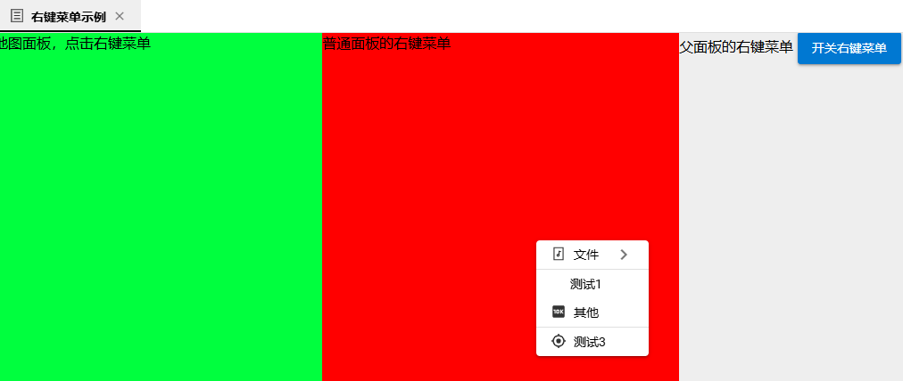

###  8. WidgetMenuBar组件（MenuBarWidget）

> 解决了：同一组件多次调用（动态import）,互相样式和状态互不影响。

WidgetMenBar是与src/settings/widgetMenuSetting配合使用的，**一组横向或纵向的Widget构建的菜单栏**，在大屏中使用较多。

之前问题：

- 一组菜单栏得复制和定义个菜单栏Widget
- 菜单栏widget里需要提前定义layoutID和widgetID，与widgetSetting配置一样
- 菜单栏widget无法跨LayoutContainer布局复用


MenuBarWidget菜单栏widget,可以广泛复用（跨LayoutContainer）


只需要根据id，在menuBarStyle.scss里定义对应不同菜单栏的布局和样式

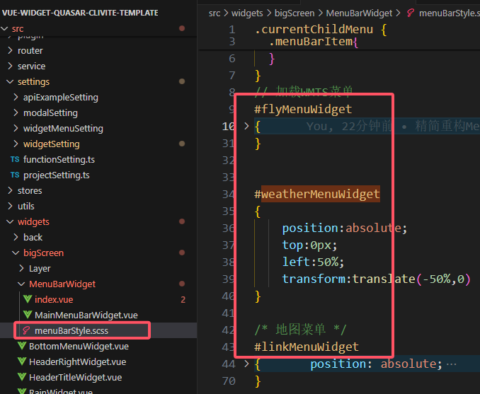

运行效果：(样式互不影响)


