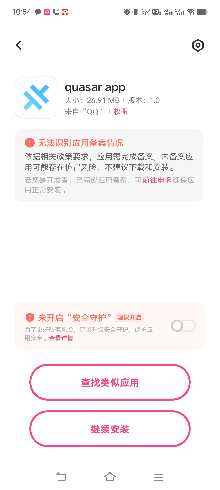

##  基于Capacitor 移动混合APP开发

### 什么是Capacitor

 **Capacitor: A cross-platform native runtime for web apps**

**Capacitor** is an open source native runtime for **building Web Native apps**. Create cross-platform iOS, Android, and Progressive Web Apps with JavaScript, HTML, and CSS.

https://capacitorjs.com/

### Capacitor原生跨平台插件

**Plugins in Capacitor enable JavaScript to interface directly with Native APIs.**

**Capacitor中的插件使JavaScript能够直接调用Native API接口**

Web apps can access the full power of Native APIs with plugins. Plugins wrap common native operations that might use very different APIs across platforms while exposing a consistent, cross-platform API to JavaScript.

Web应用程序可以通过插件访问Native API的全部功能。插件包装了常见的本机操作，这些操作可能跨平台使用非常不同的API，同时向JavaScript公开了一致的跨平台API。

Additionally, the plugin capability in Capacitor makes it possible for teams with a mix of traditional native developers and web developers to work together on different parts of the app.

此外，Capacitor中的插件功能使传统移动开发人员和Web开发人员的团队能够在应用程序的不同部分协同工作。

Capacitor automatically generates JavaScript hooks on the client, so most plugins only need to use Swift/Obj-C for iOS and/or Java/Kotlin for Android. Of course, adding custom JavaScript for a plugin is also possible.

Capacitor会自动在客户端生成JavaScript挂钩，因此大多数插件只需要使用iOS版的Swift/Oj-C和/或Android版的Java/Kotlin。当然，为插件添加自定义JavaScript也是可能的。

https://capacitorjs.com/docs/plugins

### Capacitor插件源列表

#### 官方版Capacitor跨平台插件

官网 https://capacitorjs.com/docs/apis

NPM https://www.npmjs.com/org/capacitor


#### 社区版-Capacitor Community插件

Github https://github.com/capacitor-community

NPM https://www.npmjs.com/org/capacitor-community


#### 社区版-Capawesome插件

官网：[**https://capawesome.io/plugins/**](https://capawesome.io/plugins/)

Github https://github.com/capawesome-team

NPM  https://www.npmjs.com/org/capawesome

示例工程：https://github.com/robingenz/capacitor-plugin-demo


#### Cordova兼容插件-awesome-cordova-plugins

Capacitor has support for most Cordova plugins, so developers can use the [hundreds of existing Cordova plugins](https://cordova.apache.org/plugins/) in their Capacitor apps. While certain Cordova plugins are [not compatible](https://capacitorjs.com/docs/plugins/cordova#known-incompatible-plugins) with Capacitor, most are, so it's worth trying one if there's no existing Capacitor-specific plugin available.

https://capacitorjs.com/docs/plugins/community

官网： https://danielsogl.gitbook.io/awesome-cordova-plugins

Awesome Cordova Plugins is a curated set of wrappers for Cordova plugins that make adding any native functionality you need to your [Ionic](https://ionicframework.com/) mobile app easy.

Github https://github.com/danielsogl/awesome-cordova-plugins

NPM :https://www.npmjs.com/org/awesome-cordova-plugins


- **@ionic-native 与@awesome-cordova-plugins关系**

@ionic-native NPM :https://www.npmjs.com/org/ionic-native

**<u>Ionic Native was renamed to Awesome Cordova Plugins原因</u>**

Today we are announcing some changes to the open source ionic-native project, namely that community member [Daniel Sogl](https://github.com/danielsogl) will be taking it over and it will be renamed [awesome-cordova-plugins](https://github.com/danielsogl/awesome-cordova-plugins).

https://ionic.io/blog/a-new-chapter-for-ionic-native


### Quasar Capacitor开发模式

**Capacitor5 需要Gradle8和java17**，下载最新版的Android Studio即可。

[Capacitor versions](https://quasar.dev/quasar-cli-vite/developing-capacitor-apps/capacitor-version-support)

> Requirements
>
> - Xcode 14.1+ (for iOS)
> - Android Studio Flamingo 2022.2.1 or newer (for Android)

#### Step 1: 安装开发环境

下载安装 最新版的Android Studio,[下载 Android Studio](https://developer.android.com/studio?hl=zh-cn),

通过SDK Managers可补充安装更多的 Android SDK


配置Windows上的 Android环境变量 **ANDROID_SDK_ROOT** （注意：环境变量 ANDROID_HOME 已经废弃）

cmd命令行界面运行下面的命令

```
setx ANDROID_SDK_ROOT "%USERPROFILE%\AppData\Local\Android\Sdk"
setx path "%path%;%ANDROID_SDK_ROOT%\tools;%ANDROID_SDK_ROOT%\platform-tools"
```


#### Step2：安装打包环境

1）java环境配置，打包时用到keytool命令

下载JDK  [Java Downloads | Oracle](https://www.oracle.com/java/technologies/downloads/)

安装JDK 17,配置环境变量：JAVA_HOME 为 C:\Program Files\Java\jdk-17

为path变量增加  C:\Program Files\Java\jdk-17\bin  （否则，打包是keytool命令行找不到）

cmd命令行界面运行：

```
setx JAVA_HOME "C:\Program Files\Java\jdk-17"
setx path "%path%;C:\Program Files\Java\jdk-17\bin"
```


2）打包发布apk包时，需要用到的处理命令：zipalign 、 apksigner

**注意：**配置android**打包发布**时的环境变量path，否则**zipalign命令找不到**。34.0.0为我的Android SDK版本号

例如：C:\Users\zorro\AppData\Local\Android\Sdk\build-tools\34.0.0

cmd命令行界面运行：

```
setx path "%path%;%ANDROID_SDK_ROOT%\build-tools\34.0.0"
```


#### Step 3:生成 Capacitor工程目录

生成src-capacitor

`quasar mode add capacitor`

 /src-capacitor/package.json内容类似

```
dependencies: {
  "@capacitor/app": "^5.0.0",
  "@capacitor/cli": "^5.0.0",
  "@capacitor/core": "^5.0.0",
  "@capacitor/splash-screen": "^5.0.0"
}
```

The `@capacitor/app` and `@capacitor/splash-screen` are optional, but it helps Quasar with some UI functionality if they are installed.

在src-capacitor下运行 

`npm install`

#### Step 4: 安装Capacitor插件

在quasar主工程下安装capacitor插件，例如命令如下：

```
pnpm add @capacitor-community/keep-awake
```

同时，在src-capacitor也得重新运行安装上面插件


#### Step 5: 运行调试

`$ quasar dev -m capacitor -T [android|ios]` 将启动IDE打开（Android Studio 或 Xcode） 开发环境，来连接移动设备运行调试。

**注意：首次运行时，需要下载gradle相关依赖jar包（需要翻墙）**


运行调试：打开浏览器，同步调试和输出log。

 Chrome 浏览器 URL 输入`chrome://inspect/#devices` .

Edge浏览器  URL输入 edge://inspect/#devices


###  Android 相关配置说明

#### gradle配置修改

- **gradle-wrapper.properties文件修改**

修改distributionUrl下载地址，改为gradle国内镜像地址 https://mirrors.cloud.tencent.com/gradle/

目前统一使用8.0.2

```
distributionUrl=https\://mirrors.cloud.tencent.com/gradle/gradle-8.0.2-all.zip
```


- **build.gradle文件内容替换**

完全替换下面内容，优先使用国内阿里的Maven源

```
// Top-level build file where you can add configuration options common to all sub-projects/modules.

buildscript {
    
    repositories {
      maven {
        url 'https://maven.aliyun.com/repository/public/'
      }
        google()
        mavenCentral()
    }
    dependencies {
        classpath 'com.android.tools.build:gradle:8.0.0'
        classpath 'com.google.gms:google-services:4.3.15'

        // NOTE: Do not place your application dependencies here; they belong
        // in the individual module build.gradle files
    }
}

apply from: "variables.gradle"

allprojects {
    repositories {
      maven {
        url 'https://maven.aliyun.com/repository/public/'
      }
      maven {
        url 'https://maven.aliyun.com/repository/central'
      }
        google()
        mavenCentral()
    }
}

task clean(type: Delete) {
    delete rootProject.buildDir
}

```

- gradle.properties文件修改

  增加内容：

  ```
  android.overridePathCheck=true
  android.enableJetifier=true
  ```

  

#### AndroidManifest.xml修改

路径：\src-capacitor\android\app\src\main\AndroidManifest.xml

#####  **android功能权限修改**

```
    <!-- Permissions -->
    <uses-permission android:name="android.permission.INTERNET" />
    <uses-permission android:name="android.permission.FOREGROUND_SERVICE_CONNECTED_DEVICE"/>

    <!-- 地理位置权限 -->
    <uses-permission android:name="android.permission.ACCESS_COARSE_LOCATION" />
    <uses-permission android:name="android.permission.ACCESS_FINE_LOCATION" />
    <uses-permission android:name="android.permission.ACCESS_BACKGROUND_LOCATION" />
    <uses-permission android:name="android.permission.FOREGROUND_SERVICE" />
    <uses-permission android:name="android.permission.REQUEST_IGNORE_BATTERY_OPTIMIZATIONS" />
    <uses-feature android:name="android.hardware.location.gps" />
    <!-- 图片权限 -->
    <uses-permission android:name="android.permission.READ_MEDIA_IMAGES"/>
    <uses-permission android:name="android.permission.READ_EXTERNAL_STORAGE"/>
    <uses-permission android:name="android.permission.WRITE_EXTERNAL_STORAGE" />
    <!-- 录音权限 -->
    <uses-permission android:name="android.permission.RECORD_AUDIO"/>
    <uses-permission android:name="android.permission.MODIFY_AUDIO_SETTINGS"/>
    <uses-permission android:name="android.permission.READ_CONTACTS"/>
    <uses-permission android:name="android.permission.ACCESS_NETWORK_STATE" />
    <!-- 视频需要开启的权限 -->
    <uses-permission android:name="android.permission.READ_MEDIA_VIDEO" />
    <uses-permission android:name="android.permission.WRITE_EXTERNAL_STORAGE" />
    <uses-permission android:name="android.permission.READ_EXTERNAL_STORAGE" />
    <!-- 通知权限 -->
    <uses-permission android:name="android.permission.VIBRATE" />
    <uses-permission android:name="android.permission.SCHEDULE_EXACT_ALARM" />
    <!-- 摄像头 -->
       <uses-permission android:name="android.permission.CAMERA" />
```


#####  **竖屏横屏控制**

**强制竖屏**： `android:screenOrientation="portrait"`


- **activity** **竖屏节点属性：**

  android:screenOrientation="landscape"

  - unspecified，默认值，由系统决定，不同手机可能不一致
  - landscape，强制横屏显示
  - portrait，强制竖屏显
  - behind，与前一个activity方向相同
  - sensor，根据物理传感器方向转动，用户90度、180度、270度旋转手机方向，activity都更着变化
  - sensorLandscape，横屏旋转，一般横屏游戏会这样设置
  - sensorPortrait，竖屏旋转
  - nosensor，旋转设备时候，界面不会跟着旋转。初始化界面方向由系统控制
  - user，用户当前设置的方向

参考资料：[Capacitor打包APP应用 )](http://flashme.cn/index.php/study/66.html)


#####  键盘浮在页面上面

参考链接：[android如何让布局保持位于键盘上方（一直在键盘上面）_如何让悬浮床始终在键盘的上方-CSDN博客](https://blog.csdn.net/mjyy10181103/article/details/78261500)

解决方法：

在manifest文件中的activity标签中修改android:windowSoftInputMode属性
属性参数：

各值的含义：
【A】stateUnspecified：软键盘的状态并没有指定，系统将选择一个合适的状态或依赖于主题的设置
【B】stateUnchanged：当这个activity出现时，软键盘将一直保持在上一个activity里的状态，无论是隐藏还是显示
【C】stateHidden：用户选择activity时，软键盘总是被隐藏
【D】stateAlwaysHidden：当该Activity主窗口获取焦点时，软键盘也总是被隐藏的
【E】stateVisible：软键盘通常是可见的
【F】stateAlwaysVisible：用户选择activity时，软键盘总是显示的状态
【G】adjustUnspecified：默认设置，通常由系统自行决定是隐藏还是显示
【H】adjustResize：该Activity总是调整屏幕的大小以便留出软键盘的空间
【I 】adjustPan：当前窗口的内容将自动移动以便当前焦点从不被键盘覆盖和用户能总是看到输入内容的部分

增加或修改下面内容：

 android:windowSoftInputMode="adjustPan"


键盘浮在页面的上面，效果图：


#### Android APP名称设置

  设置app安装名称和app的桌面显示名称，路径为

**<u>src_capacitor/android/app/src/main/res/values/strings.xml</u>**


app_name为安装时显示名称

title_activity_main为app桌面图标显示名称

### Capacitor  Android打包发布

#### 打包发布版

```
 quasar build -m capacitor -T android
```


#### Android APP打包发布处理

==注意：==

> <u>apk文件实质上是zip压缩格式，再**Android 11以上**，apk需要进行4字节对齐。</u>
> 安卓SDK提供了 对齐工具zipalign。

zipalign 是一种 zip 归档文件对齐工具。它可确保归档中的所有未压缩文件相对于文件开头都是对齐的。这样一来，您便可直接通过 mmap(2) 访问这些文件，而无需在 RAM 中复制相关数据并减少了应用的内存用量。

[Android 11 重打包对齐错误_failure [-124: failed parse during installpackagel-CSDN博客](https://blog.csdn.net/xys616/article/details/123892541)


下面参考来源：[quasar官网publish to store](https://quasar.dev/quasar-cli-vite/developing-capacitor-apps/publishing-to-store)

1. 使用JDK >bin目录下的keytool工具，生成密钥store，需要输入和记住密码

   ```
   keytool -genkey -v -keystore my-release-key.keystore -alias alias_name -keyalg RSA -keysize 2048 -validity 20000
   ```

2. 使用zipalign 对齐apk安装包

   ```
   $ zipalign -v 4 <path-to-same-apk-file> HelloWorld.apk
   ```

   

3. 使用android sdk 下的build-tools中找到，apksigner 进行签名

   ```
   apksigner sign --ks my-release-key.keystore --ks-key-alias alias_name <path-to-unsigned-apk-file>
   ```


打包后安装示例：

<center class ='img'>


</center>


#### Capacitor版本升级后无法打包问题

 capacitor升级到6.0.0后，导致app无法打包，报错：“Execution failed for task ':app:checkReleaseAarMetadata'.”

解决方法：

1、src-capacitor/android/variables.gradle中变量targetSdkVersion和compileSdkVersion值由33改为34


2、修改gradle-wrapper.properties里的gradle版本，路径为src-capacitor/android/gradle/wrapper/gradle-wrapper.properties

distributionUrl=https\://mirrors.cloud.tencent.com/gradle**/gradle-8.2.1-all.zip**


3、build.gradle的buildscrptip路径为src-capacitor/android/build.gradle的dependencies

 classpath 'com.android.tools.build:gradle:8.2.1'


#### Node低版本16.x下@quasar/app-vite无法编译和Capacitor无法打包问题

原因：@quasar/app-vite 和 @capacitor/cli 都要求node版本大于18.0.0

解决方法：

- @quasar/app-vite的修改

- @capacitor/cli的修改

  

### Capacitor 将file://本地地址转换http地址

https://ionicframework.com/docs/core-concepts/webview#file-protocol

 **File Protocol**

Capacitor and Cordova apps are hosted on a local HTTP server and are served with the `http://` protocol. Some plugins, however, attempt to access device files via the `file://` protocol. To avoid difficulties between `http://` and `file://`, paths to device files must be rewritten to use the local HTTP server. <u>For example, `file:///path/to/device/file` must be rewritten as `http://<host>:<port>/<prefix>/path/to/device/file` before being rendered in the app.</u>

For Capacitor apps, convert file URIs like so:

```javascript
import { Capacitor } from '@capacitor/core';

Capacitor.convertFileSrc(filePath);
```

For Cordova apps, the [Ionic Web View plugin](https://github.com/ionic-team/cordova-plugin-ionic-webview) provides a utility function for converting File URIs: `window.Ionic.WebView.convertFileSrc()`. There is also a corresponding Ionic Native plugin: [`@awesome-cordova-plugins/ionic-webview`](https://ionicframework.com/docs/native/ionic-webview.md).

工程里示例代码：

```typescript
function add3DTileModel() {
  const layer = new TilesetLayer('layer')
  viewer.addLayer(layer)
  const filePath='file:///storage/emulated/0/Android/data/com.digsur.flight.navi/files/end3d/tileset.json';
  let tileset = new Tileset(
    // 'end3d/tileset.json'
    Capacitor.convertFileSrc(filePath)
  )
  tileset.setHeight(1420)
  layer.addOverlay(tileset)
  viewer.flyToTarget(tileset);
}
```


